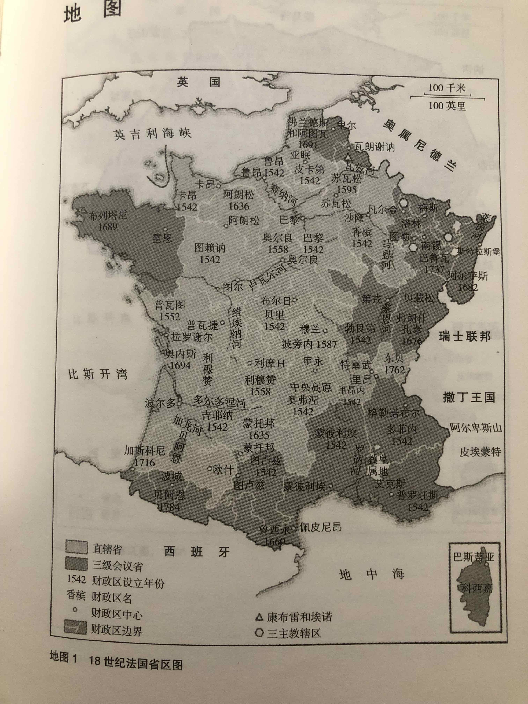
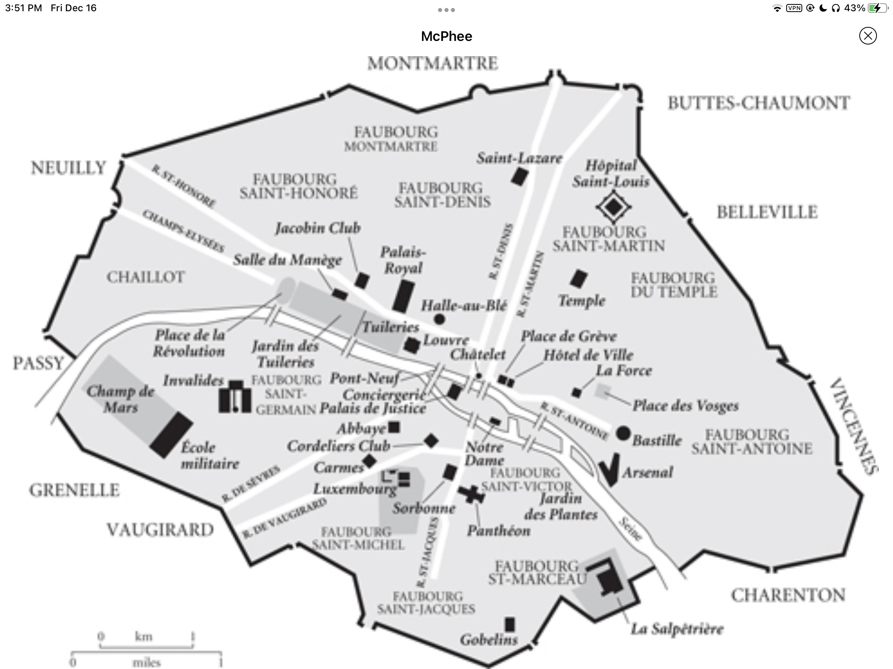

# 自由与毁灭

## Basic Info

**Subtitle**: 法国大革命，1789 - 1799

**Author**: Peter McPhee

**English Name**: Liberty or Death: The French Revolution

## 导言

问题：

* 一个表面上看起来稳定的证券是为什么、如何在1789年倒台的？

* 为什么革命过后稳定一个新秩序会如此艰难？

* 革命期间的政治动荡在根本上阻碍了社会和经济的持续发展吗？

* 法国大革命史法国历史上甚至是世界历史的一个重要转折点，还是一段旷日持久的暴力动荡以及令数百万人丧命饿战争冲突？

毛主席名言：

> a revolution is not a dinner party, or writing an essay, or painting, or doing embroidery; it cannot be so refined, so leisurely and gentle, so temperate, kind, courteous, restrained and magnanimous. A revolution is an insurrection, an act of violence by which one class overthrows another. 
>
> 革命不是请客吃饭，不是做文章，不是绘画绣花，不能那样雅致，那样从容不迫，文质彬彬，那样温良恭俭让。革命是暴动，是一个阶级推翻一个阶级的暴烈的行动。

* 巴黎的政府与在乡村、城市、城镇的人民之间如何协商、对抗？

* 农村和小城镇的人是如何接受、适应或拒绝来自巴黎的改变的？

* 法国大革命史是一场视觉文化和口语文化的暴风骤雨

18世纪法国省区图：

## 第一章 拼凑起来的权力和特权：18世纪80年代的法国

### 18世纪法国的概况

1775.6 路易十六 兰斯 加冕

“国王的触摸”

波旁王朝

地方性的特权：

* 某些城镇和省份享有诸如税收水平上的特权地位
* 教会和贵族在整个王国共同享有特权

18世纪的法国人：天主教徒 + 国王的臣民

人们内心的认同根植于他们所在的某一省份或地区。

语言：朗多克省几百万人说奥克语的变种；东北部人口说佛兰德语；洛林人说德语；西班牙边境人说加泰罗尼亚语和巴斯克语；布列塔尼大约有100万人说凯尔特语。

大量农业人口

18世纪法国权威和特权的三根支柱：**国王**、**天主教会**、**贵族**

王国的税收、什一税和土地租税加起来占农民总收入 15% - 40%

1750年后连年丰收，人口增长

大多数法国农村：混合农业，家庭培育多种农作物和牲畜作为食物和衣物的来源

只有靠近大城市的富裕地区，才能让拥有大量农场的地主和佃户将所有的生产集中在小麦等单一农作物上

大规模农业区：农场工人占总人口一半

大多数地区：大部分人都是小块土地的拥有者、承租者以及收益分成的佃农。

纺织工业：核心位于法国乡村，以妇女业余时间的手工劳动为主

大多数乡村公社限制“剩余农产品”交易流向城市

> 对于靠近市镇的大部分农民来说，定期集市更多的时候是一个进行当地集体文化仪式的场合，而不是交换产品的场所。

地方城市和省份通过“**团体**”（corporations）组织起来。

一些“**团体**”（教会和贵族等）享有团体的“权利”和“特权”。

“中世纪模式”：三个等级分别负责祈祷、战斗以及工作

教会与贵族享有独立司法权和免税特权：

* 教会只需缴纳一笔“自愿捐赠”（don gratuit），最多不超过其年收入5%

* 18世纪，王权面临日益增长的战争开销和统治费用，成功向贵族征收了一系列税收

总体来说，普通人财产的税率比贵族高

乡村社会消费了大量产出以至于城镇和城市面临周期性的食物短缺问题，并且反过来限制了乡村对于城市工业品的需求。

20%的法国人住在城市

人口超过5万的城市8座（巴黎65w、里昂14.5w、马赛、波尔多、南特、里尔、鲁昂和图卢兹），1万-4万人之间70座

城市由个体手工业主导，主要满足城市自身人口和临近腹地的需求；有一些大规模制造业

城市具有行政、司法、宗教、维持治安等功能，各省首府

**首都凡尔赛与王国其余部分的交流通常是缓慢的、不确定的**

法国的疆域和地形限制了政令、法律的传达以及商品的流通。

1765年 改善道路

### 巴黎

巴黎是道路交通网的中心，塞纳河是（约讷河、奥布河和马恩河）的汇集处

巴黎有城墙，对进入城市的货物征税

城墙内有多个“郊区”（[faubourg](https://en.wikipedia.org/wiki/Faubourg)）

巴黎的阶级分布：

* 富人住在西郊
* 大部分巴黎人住在靠近塞纳河中心地区的拥挤街道

* 富有的资产阶级或贵族与他们的家庭仆人一起居住在地面商店和作坊之上的一、二层
* 工匠和穷人住在顶楼和阁楼
* 职业结构出现了大量大规模工业，但还是以个体手工业为主

“师傅”控制着行业的准入权。某些行业中（例如建筑业与印刷业），师傅和工人矛盾严重

1781年 政府推行工作证制度，记录工人的一举一动，强化师傅权力，引起工人不满

天主教

1785-1787年 总包税局将巴黎核心地带之外的郊区纳入新的税收体系内。增加的税收和上涨的物价引发广泛的不满

城墙外聚集了很多穷人

从事技术行业的男性通过手工业行会团结起来，保证日常的工作和工资，提供娱乐场所。每天工作时间14-16h

在巴黎的圣日尔曼市场，妇女占有57个摊位中的48个

### 阿拉斯

阿图瓦省首府

1659 《比利牛斯合约》并入法国

人口 22500

城市区块：

* 教区：富裕贵族与资产阶级
* 斯卡尔普河支流沿岸：穷人街区
* 军队“堡垒”
* 公共建筑区：王室行政机构、教会和司法机构

大量天主教建筑，4%人口为宗教城市

### 东北部

大型铸铁厂和煤矿周围兴起小型工业中心：

勒克鲁索、尼德布隆、昂赞

### 大西洋沿岸

港口

加勒比海奴隶贸易

造船业、殖民地货物加工业

在沿海港口（波尔多、勒阿弗尔、南特和马赛），大的河流港口（鲁昂、巴黎、里昂）及其腹地，经济发展动力：海外贸易、奢侈品消费以及专业化农业

### 资产阶级

中产阶级从事司法行业、为王室行政管理的行业和投资地产

低级官职由中产阶级担当

土地和庄园投资是中产阶级提升社会地位的方式

可通过购买官职来获得贵族身份

最富裕的资产阶级一心想成为贵族，贵族则想和他们划清界限

### 城市与农村的关系

* 在地方城市，资产阶级在乡村拥有大量地产，从佃户处收取租金；乡村妇女进入城市，为资产阶级家庭提供家政服务
* 城市中的劳动妇女会将婴儿送去乡村让奶妈喂养。*婴儿在乡村中存活的机会更大*
* 高原地区男性在漫长的农闲时节来城市找活计

**最重要的联系：食物供应**

* 正常年月，城市工人需要把一半工资花在食物上
* 饥荒年月，物价上涨，城市居民和乡村中贫困人口关系紧张
* 地方商人将乡村谷物拿去城市卖，威胁到乡村中贫困人口的生存
* 城市街区的妇女试图用“平民税”将物价维持在正常水平。乡村，农民团结在一起组织稀缺资源运往市场

18世纪法国存在大规模贫穷，绝大部分人很难抵御荒年歉收的威胁

高出生率，高死亡率。高达一半的儿童在五岁前死亡，活过婴幼儿时期的人平均期望寿命50岁。

### 宗教

教士约占总人口0.6%

“正式”教士（僧侣和修女）和“世俗”教士（牧师和助理牧师）

“世俗”教士主要服务底层社会

教会财富大部分来源于什一税，加上教会地产的收成和租税

在很多城市，教会是当地人民主要的工作来源

男性修道院衰落，女性修会繁荣

> 在整个法国乡村，教区的教士是社区的核心：他们提供精神上的慰藉和鼓励，在人需要的时候指点迷津，他们是布施善举的人，是雇主，还是外界新闻的来源。

冬季月份，教区教士提供基础教育。识字率在全国范围内不均衡。

#### 天主教

97%的法国人名义上都是天主教徒，不过出现信仰消退的迹象

在西部地区较为强盛：布列塔尼、比利牛斯山沿线、中央高原南部

#### 新教

1788年前，想要做礼拜的新教徒必须至少在公开场合放弃自己的信仰

东部部分地区，中央高原

1787.11 《宽容法令》：恢复新教徒公开进行宗教仪式的权利以及他们的司法身份和公民身份

#### 犹太教

总计约4万人

波尔多、巴约讷、阿维尼翁、阿尔萨斯-洛林。

西南部：西裔犹太人，享受王室承认的“权利”

东部：德裔犹太人，被接纳程度较低。经常发生反犹运动

### 贵族

宗教团体的领袖、主教和大主教被贵族把持

贵族约占总人口的0.4%

特权：财政和领主特权、通过徽章展示身份，独享担任一系列官职的权利

军官几乎都是贵族出身

贵族内部存在分化

“穿袍贵族”  ---- “佩剑贵族”

贵族直接占有1/3的土地，并对其余的大部分土地行驶领主“权利”，收取收成税以及其他税收

### 行政

**传统意义上的义务和特权与变动的社会现实、各个等级内部财富地位的两极分化之间产生了巨大的不协调。**

”弹性的稳态“

**国王的权威**在维护稳定上至关重要

高等法院

1682 《法国教士法令》 国王成为高卢教会的首领。

\*以下这段话我完全看不懂 (＠_＠;)

> 统治18世纪法国的精英——路易十六和他的宫廷，以及掌握土地财富、行政管理、教会和司法的贵族精英——通过消除相互之间的矛盾二团结在一起。特权等级和国王之间的关系基于相互依赖和妥协：这种权力平衡很不稳定。自从路易十四在1682年颁布《法国教士法令》，国王成了高卢教会的首领，这意味着高卢教会在宗教权威和组织机构上脱离罗马实行自治，反过来国王要依靠教会来宣扬王权的权威性和合法性。作为回报，天主教会垄断着公众信仰和道德准则。同样，作为对忠诚、顺从的贵族的回报，国王承诺贵族在教会、军队、司法和行政等各个体制中担任首脑。

国王的官僚机构规模偏小、能力有限。只有6名大臣（外交、战争、海军、财政、司法、王室事务）

征税工作被“转让”给私人包税商

对新并入的省份，王权尊重本土贵族和教士精英的特殊传统和特权

39个省份，划分成36个财政区，设督办官

**直辖省**和**三级会议省**

法庭判决取决于审判对象的社会等级和居住地。对普通人（尤其是穷人）的惩罚尤为严厉

从事贸易和手工业者的不满：

* 法律条文复杂
* 没有统一的度量衡和货币
* 国内关税堡垒

1664年 北方组件关税同盟

不同地区税收制度不同，税率不同

> 法国是一个复杂的等级社会，权威的力量确保了相对的服从和稳定。小城镇和村庄的人们居住在一个由贵族和教会主导的世界里，贵族和主教们在精神上、司法上和物质上的权力通过共同体日常的生活得到强化，教会标记着时间和季节，领主因为控制着共用的烤炉和榨油机而受到尊重。同样，几个世纪以来，特权等级还通过建造城堡、教堂这些物理景观来树立他们的尊严，像他们的先辈一样重新唤起普通人劳作的义务和对更高等级的服从

### 叛乱

常见食物叛乱和对特权者出格行为的不满。体制内部的反抗。

开始有旨在颠覆体制的反抗。年轻人拒绝对领主做出“服从的姿态”。“自由”精神
