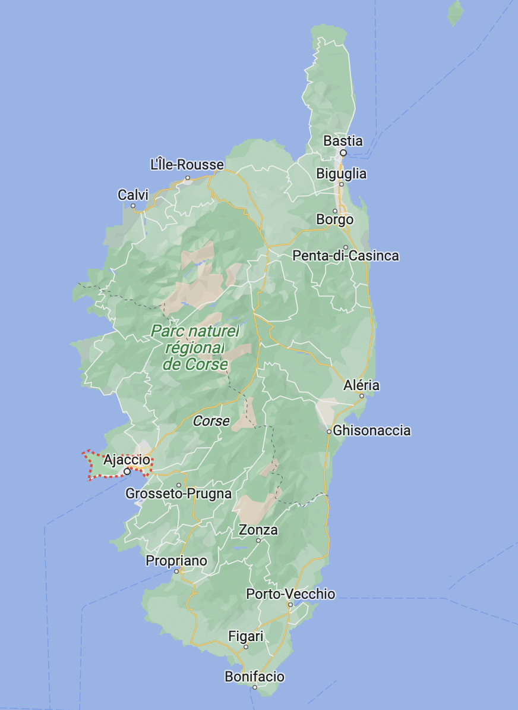
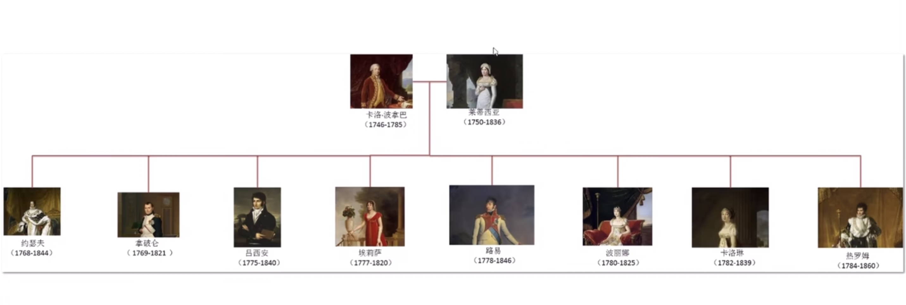
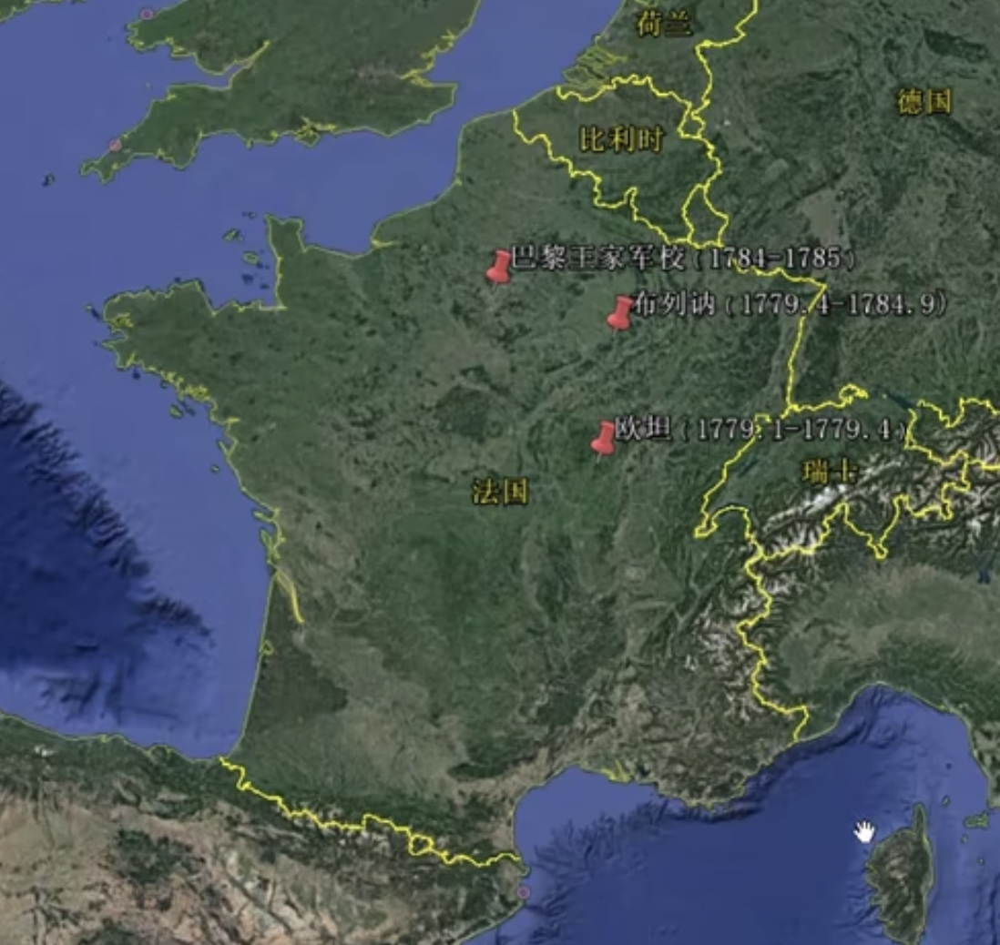
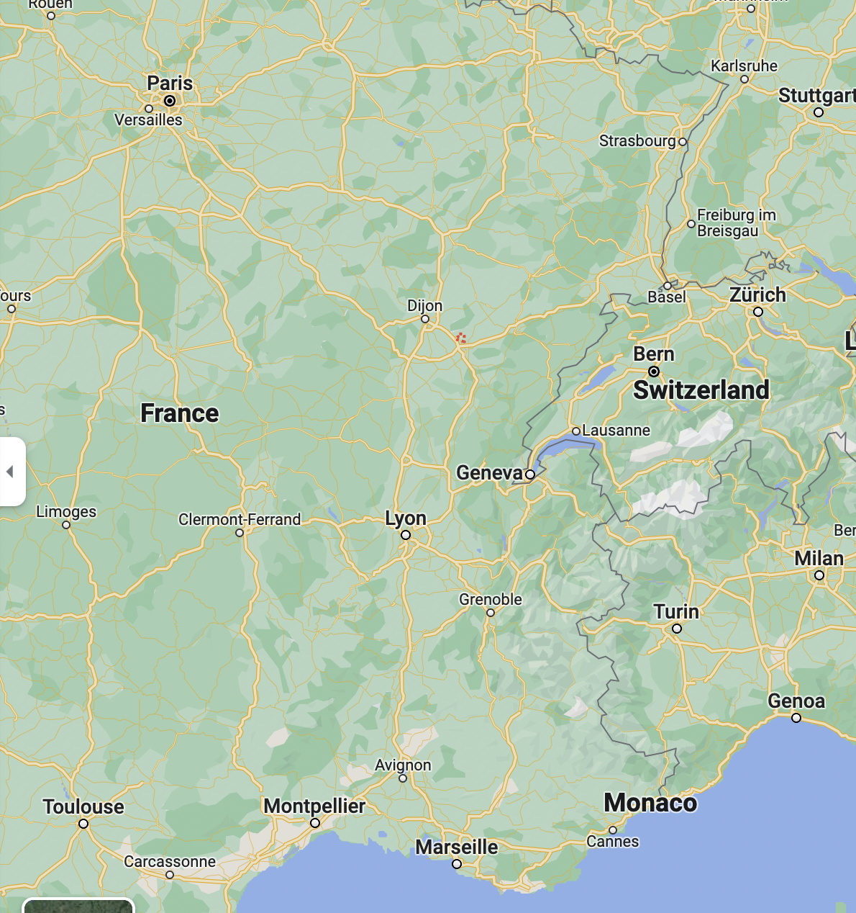

# 拿破仑大帝

## Basic Info

**Author**:  Andrew Roberts 

**English Title**:  Napoleon the Great 

## 第一章 科西嘉

1769年 科西嘉 阿雅克肖（Ajaccio） 拿破仑出生

### 拿破仑的家族关系

#### 轶事

> 拿破仑一掌权就优待母亲，他为她买下塞纳河(the Seine)畔的蓬城堡(Château de Pont)，让她每年可享100万法郎。莱蒂齐娅把大部分拨款存起来，她吝啬得出了名，当有人为此嘲笑她时，她回答：“谁知道呢，也许有一天，我得给所有这些我生下来的国王孩子找面包吃。”

### 科西嘉

之前一直属于热那亚共和国

1750s 闹独立 领袖：[保利](https://en.wikipedia.org/wiki/Pasquale_Paoli)，卡洛·波拿巴为保利副官

1768 热那亚将科西嘉转卖给法国

1769 保利在蓬泰诺沃（Ponte Nuovo，“新桥”）之战中失败 流亡 卡洛·波拿巴与法国合作 法国驻科西嘉总督 [马尔博夫伯爵](https://en.wikipedia.org/wiki/Charles_Louis_de_Marbeuf)

> “他发现并入法国会给祖国带来巨大利益，”约瑟夫·波拿巴描写自己的父亲道，“于是他就成了优秀的法国人。”

1770 马尔博夫伯爵在科西嘉推行法国化政策

> 他颁布法令，宣布凡能证明自身贵族家世长达两个世纪的科西嘉人皆可享有法国贵族(noblesse)的广泛特权

拿破仑家族跻身法国贵族之列

### 拿破仑的求学生涯

1779.1 — 1779.4 欧坦主教管理的教会神学院

1779.4 — 1784.9 香槟地区(Champagne)特鲁瓦(Troyes)附近的布列讷堡(Brienne-le-Château)王家军校

1776年路易十六建立的12所王家军校之一

1785 进入巴黎王家军校

1785.9 成为炮兵军官

#### 轶事

> 拿破仑也精于地理，就在他的学校练习册的最后一页上，他在一长串英国王室领地名称后写着：“圣赫勒拿：小岛。”(Sainte-Hélène：petite île.)

### 拿破仑的启蒙思想

#### 古典作家

> ......但是课表中有很多古典著作：男孩们专注于古典罗马史和拉丁语，以至于比最近的法国史还熟悉。亚里士多德的《伦理学》是一份关键文本，告诉学生骄傲、嫉妒、放荡和贪婪是智慧、公正、自制、知识、纪律和谦虚的对立面，会有损国家的美德。此外，最近被译成法语的普鲁塔克的《希腊罗马名人传》，成为拓展历史学习兴趣的最好文本。但是主导整个课程的依然是拉丁语，连哲学也是用拉丁文讲授的。从贺拉斯、维吉尔、西塞罗的文章以及像塔西佗、李维、萨鲁斯特等作家的摘要中，学生们学习古老的历史和政治，尤其是共和国晚期和奥古斯都时期的罗马。
>
> 公民美德在古典著作中被描述成爱国、热爱自由、朴素、勤勉、自我牺牲、勇气、正直和公正，与作者们身边所看到的奢侈、贪婪、阴谋和腐败等丑恶形成了鲜明的对比。西塞罗控诉喀提林的阴谋的演讲是一份关键文本，西塞罗在反对喀提林贵族集团在公元前1世纪夺权的密谋中处置果断、毫不妥协。马克西米利安·罗伯斯庇尔的同学卡米耶·德穆兰后来回忆道：“无论多少次我想起西塞罗，我的双眼都噙满泪水。”西塞罗的演讲强调了密谋者的不道德举动和他们用性与金钱贿赂来达成目的的行为。

以上出自《自由与毁灭：法国大革命》

> 拿破仑从学校图书馆借了很多传记和历史书，如饥似渴地阅读普鲁塔克笔下的英雄传说、爱国事迹与共和国美德故事。他也读了恺撒、西塞罗、伏尔泰、狄德罗、雷纳尔(Raynal)教士以及伊拉斯谟、欧特罗皮乌斯、李维、菲得洛斯、撒路斯特、维吉尔的著作

*问题：这个“菲得洛斯”是谁*

*答：英文版里为 Phaedrus，搜了下是柏拉图《斐德罗篇》的对话者。不过在一堆罗马人里蹦出一个希腊人着实有点奇怪*

> 一个同时代人回忆说，拿破仑曾逃课去学校图书馆，在馆内阅读波里比乌斯、普鲁塔克、阿里安（“他读得很开心”）、昆图斯·库尔提乌斯·鲁弗斯（他“不太喜欢”）的著作。波里比乌斯的《历史》按时间顺序记述罗马帝国的兴起，描述了他目击到的汉尼拔之败与迦太基洗劫事件。普鲁塔克的《希腊罗马名人传》简要刻画了拿破仑最崇拜的两位英雄——亚历山大大帝和尤利乌斯·恺撒。阿里安的《亚历山大远征记》是亚历山大战史的最好史料之一。昆图斯·库尔提乌斯·鲁弗斯的作品只有一本传世，而这本书是亚历山大的传记。

#### 启蒙作家

##### 卢梭

> 让-雅克·卢梭(Jean-Jacques Rousseau)的800页小说《新爱洛伊丝》(La Nouvelle Héloïse)描写爱与赎罪，拿破仑称，9岁时他第一次读这本书，“它改变了我的思想”。

卢梭同时也是科西嘉独立的支持者之一，曾为科西嘉起草自由宪法

#### 革命信条

> 他接受革命信条中的法律面前人人平等、理性政府、精英政权、效率和激进民族主义，此举很符合这种思潮，但他对结果平等、人权、媒体自由、代议制政府这些信条无甚兴趣，在他看来，它们都不太符合军事思潮。拿破仑所受的教育让他尊重社会等级、信奉法律与秩序、强烈推崇奖赏人才与勇士，但也令他厌恶政客、律师、记者和英国。

### 拿破仑在欧索讷

1788年5月下旬，拿破仑待在法国东部的欧索讷(Auxonne)炮兵学校，该地靠近第戎(Dijon)

拿破仑试验使用加农炮取代臼炮，取得成功

《论王权》：军事统治强于专制体系

#### 暴乱

>  瑟尔(Seurre)发生暴乱，暴动人群杀死了两名谷物商。拿破仑奉命沿索恩河(the Saône)下行20英里，去瑟尔镇压暴动。这次行动中，他担任副指挥......没过多久，暴动也波及欧索讷本地，暴民袭击了公共建筑，还烧毁了税务局

大革命的前兆

> 1788年至1789年的严冬加剧了政治动荡，城市和乡村饿殍遍地、哀鸿遍野......不期而至的政治冲突和经济危机同时出现，贫穷的劳动者绝望地期待三级会议，与此同时产生的囤积谷物的谣言和阴谋也持续升温。1789年3月21日，马赛的劳动者贴出海报抗议取消财产不足者的代表资格的规定：“如果你有勇气，现在就展现出来。”两天以后，收税员和督办官的住所被袭击，人群洗劫了存有鱼和面粉的仓库，他们高喊着“国王万岁！”，好像他们在以国王的名义劫掠。在3月到4月间，包括康布雷、瓦朗谢纳、瓦讷、贝藏松和阿朗松在内的城镇也同样爆发了夹杂着生存和政治诉求的暴力抗议......由于严冬持续到了春季，饥荒和不安已经到了临界点，路易十六召集三级会议更是提高了人们的期待。小城镇、农村和城市的人民开始用彻底、非法的方式挑战现有社会秩序，以此表达他们的态度。农民拒绝缴纳捐税，在东北部的康布雷和埃诺、弗朗什孔泰和巴黎盆地等地的部分地区都发生了抢劫食物补给的情况

以上出自《自由与毁灭：法国大革命》

### 大革命的开始

1789年5月5日 三级会议召开

1789年6月20日 第三等级代表誓称制定新宪法前不解散，此时他们已自称国民议会(National Assembly)

1789年7月14日 巴士底狱被攻占

1789年8月26日 国民制宪议会通过《人权宣言》

1789年10月6日 凡尔赛宫被攻占

## 第二章 大革命

吕西安加入雅各宾派

## 第三章 渴望

## 第四章 意大利

## 第五章 克敌制胜

## 第六章 和平

## 第七章 埃及

## 第八章 阿克

## 第九章 雾月

