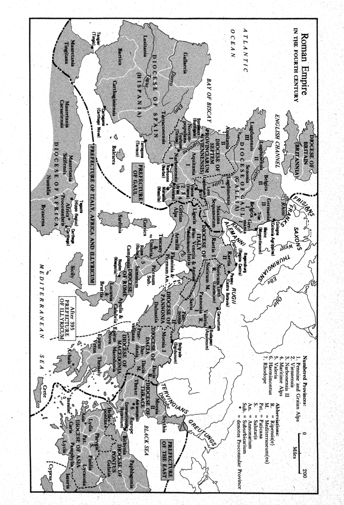

# 墨洛温王朝

## Basic Info

**Subtitle**: 创建与变革

**Author**: Patrick J. Geary

**English Name**: Before France and Germany: The Creation and Transformation of the Merovingian World

## 第一章 公元5世纪末的罗马

4世纪的罗马帝国：

罗马人和蛮族间有贸易往来

罗马军人退役后即在边境附近定居下来

西罗马帝国晚期，罗马已经蛮族化相当严重了，而蛮族也已罗马化严重

### 西部行省

#### 边境地区的罗马化

以普通人为代表：包括罗马士兵与商人

多为来自西部人口更多地区的农民，退役后则在当地定居成为富裕农民

他们身上罗马文明：

- 粗糙的（拉丁语）识字能力，刚好可适应军事工作

- 浴场、竞技场等舒适的生活设施
- 对权力带来好处的享用

#### 高卢

行政上分为：

- 纳博讷高卢（元老院行省）Gallia Narbonensis
- 卢格敦高卢（皇帝行省）Gallia Lugdunensis
- 阿基坦高卢（皇帝行省）Gallia Aquitania
- 比利时高卢（皇帝行省）Gallia Belgica

行省罗马化

城市以地方议会（元老院？）curia 为中心，负责承担各种公共服务，包括征税等

以农业为主。谷物是高卢大部分地区的主要农产品

城市中的重要人物在乡间拥有庄园/别墅

#### 上下日耳曼行省

军事化程度更高，军事要塞（castra）影响力大

上下日耳曼行省由军事指挥官直接管理

#### 帝国

帝国的文化、经济和人口中心：东部大城市：Alexandria、Antioch、Ephesus ......

西部只有一个真正的城市：罗马

#### 多瑙河边界

帝国在此大量驻军

潘诺尼亚大平原：入侵欧洲的主要通道之一

多瑙河：通向巴尔干和意大利的水桥

阿尔卑斯-多瑙河一线的行省：**Rhaetia**（南德、瑞士、奥地利的一部分、北意大利的一部分）、**Noricum**（奥地利大部、斯洛文尼亚）、**Pannonia Superior**（奥地利、克罗地亚、匈牙利、斯洛伐克、斯洛文尼亚）、**Pannonia Inferior**（[Hungary](https://en.wikipedia.org/wiki/Hungary), [Serbia](https://en.wikipedia.org/wiki/Serbia), [Croatia](https://en.wikipedia.org/wiki/Croatia), and [Bosnia and Herzegovina](https://en.wikipedia.org/wiki/Bosnia_and_Herzegovina)）、**Dacia**（大致相当于现代的罗马尼亚）、**Moesia Superior**（modern eastern [Serbia](https://en.wikipedia.org/wiki/Serbia), [Kosovo](https://en.wikipedia.org/wiki/Kosovo), north-eastern [Albania](https://en.wikipedia.org/wiki/Albania), northern parts of [North Macedonia](https://en.wikipedia.org/wiki/North_Macedonia) ）、**Moesia Inferior**（[Northern Bulgaria](https://en.wikipedia.org/wiki/Northern_Bulgaria), [Romanian Dobruja](https://en.wikipedia.org/wiki/Northern_Dobruja) and small parts of [Southern Ukraine](https://en.wikipedia.org/wiki/Southern_Ukraine)）

### 公元3世纪到6世纪的帝国

### 西部社会的转型

### 赢家：地主贵族

西部帝国陷入了个人极度富有而国库亏空的矛盾之中

极为富有的元老院贵族

新的贵族阶层

### 输家：其余所有人

## 第二章 截至公元6世纪的蛮族世界

### 迁徙前的蛮族社会

（古典作家笔下的）日耳曼人：与凯尔特人以及斯拉夫人没有明确的界限

根据考古学证据：日耳曼社会起源于铁器时代的一些民族，自前6世纪起，出现于中欧北部和斯堪的纳维亚半岛南部地区。”亚斯托夫文化“

### 东部帝国和哥特人

“哥特人”实质上是一系列小群体组成的军事政治集团，围绕强大的战争领袖建立

|  时间 | 事件 |
|  ----  | ----  |
|公元1世纪|自称哥特人的蛮族定居在奥得河与维斯瓦河之间地区；部落联盟|
|2世纪晚期-3世纪|哥特式军事组织进入黑海地区，与当地部落组建强大军事联盟|
|3世纪|哥特人进攻罗马，最终被罗马击败。哥特军事联盟崩溃|
|3世纪-4世纪|黑海地区出现新的哥特民族：瑟文吉人与格鲁森尼人（斯基泰人）|
|322年|瑟文吉人的领袖阿里亚里克与罗马结盟|
|369年|阿塔纳里克与罗马签订条约，确立哥特人与罗马人的平等地位|
|376年|匈人入侵，阿塔纳里克领导的军事联盟被摧毁。大量瑟文吉人进入罗马边境；格鲁森尼人被匈人征服，大部分被吸纳到匈人联盟中|

### 西部帝国和法兰克人

排墓文明（row-grave civilization）

西日耳曼人没有明确的神话或起源

可能和哥特人一样：以军事领袖为中心的部落联合体

## 第三章 克洛维王国时期的罗马人和法兰克人

### 法兰克人的起源

### 克洛维

### 统治法兰克王国：行政遗产

### 法兰克王国的人民

## 第四章 公元6世纪的法兰克王国

### 克洛维在公元6世纪的继承人

### 对外扩张

### 内部构成

### 主教们：出身高贵和信仰高尚

### 主教的宗教角色

### 修道院

### 图尔的马丁

### 罗讷地区

### 主教反对修士

## 第五章 克洛泰尔二世和达戈贝尔特一世治下的法兰克王国

### 法兰克王国再统一

### 法兰克王国各个地区

### 王家宫廷

### 王国地产

### 王室传统的基督教化

### 贵族传统的创造

### 高隆庞

### 基督教法兰克贵族阶层

