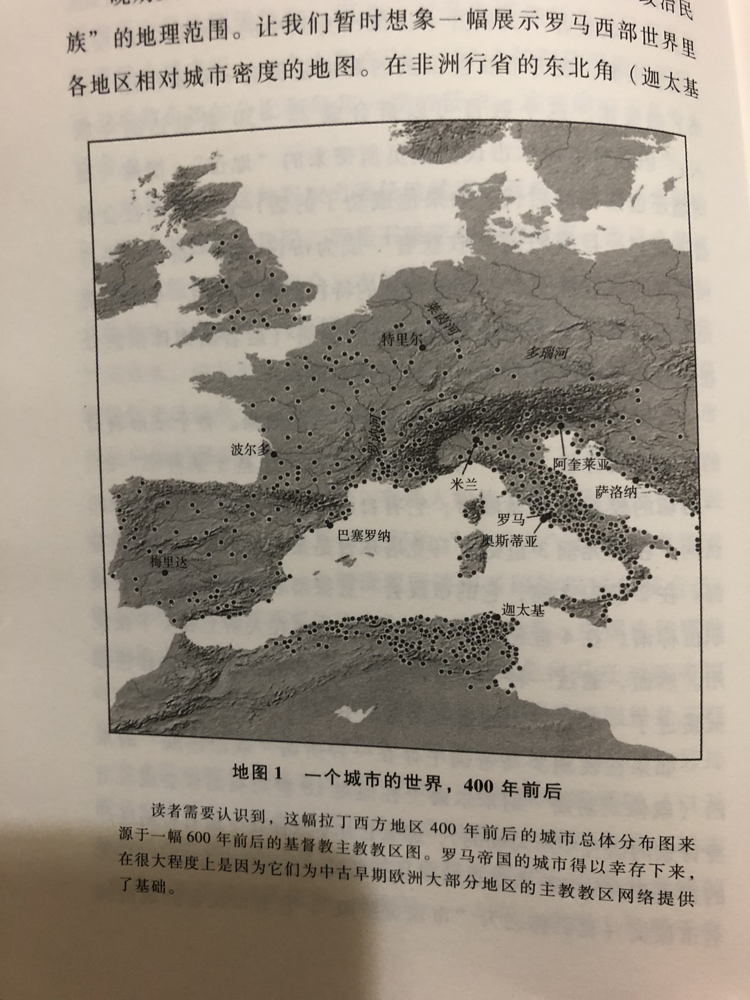

# 穿过针眼

甲骨文 抽丝读书会 2022.11 共读活动

## Basic Info

**Subtitle**: 财富、西罗马帝国的衰亡和基督教会的形成，350 - 550年

**Author**: Peter Brown

**English Name**: Through the Eye of a Needle: Wealth, the Fall of Rome,  and the Making of Christinanity in the West, 350-550 AD

## 导读

[古代晚期](https://en.wikipedia.org/wiki/Late_antiquity)

**20世纪的几位重要罗马史家**：[亨利·皮朗](https://en.wikipedia.org/wiki/Henri_Pirenne)，[道普施](https://en.wikipedia.org/wiki/Alfons_Dopsch)，[罗斯托夫采夫](https://en.wikipedia.org/wiki/Michael_Rostovtzeff), 未把基督教兴起有效纳入罗马帝国衰亡原因的讨论。

Brown 的主要著作

* 奥古斯丁传 *Augustine of Hippo: A Biography*

  * 布朗于此开始古典晚期的研究
  * 关心作为“历史中的人”的奥古斯丁

* 古代晚期的世界：从马可·奥勒留到默罕默德 *The World of Late Antiquity* 

  * 1969，1970年，布朗开了两门课：“拜占庭、波斯与伊斯兰的崛起”和“从马可·奥勒留到默罕默德的社会与超自然世界”，为本书核心内容的来源。

  * “古代晚期”术语的来源

  * > 这本书是一项关于社会和文化变迁的研究。我希望读者读完本书后能够在这些问题上有所心得：**古代晚期的世界（大约从公元200年到700年）**在什么意义上不同于**"古典"**文明；造成这种不同的原因是什么；以及这个时代发生的迅猛变革又是如何决定了西欧、东欧和近东之后的不同演进路线。

  * 以奥勒良皇帝为起点，以伊斯兰阿拔斯王朝的崛起为终点。皮朗：“没有默罕默德就没有查理曼。”

  * 社会革命（西罗马灭亡，蛮族与伊斯兰崛起）和精神革命（基督教信仰主导地位的获得）之间的联系。

* 圣人在古代晚期的兴起和功能 *The Rise and Function of the Holy Man in Late Antiquity*

  * 社会权力的**人格化**：古典晚期不同于之前古典时代和之后中世纪的重大特征

  * 5、6世纪大量离群索居、实践苦行生活的基督教圣人（holy men）出现在地中海东部，被各社会阶层尊敬和崇拜。

  * 在小地产趋于主流的东部省份，尤其是叙利亚，圣人代替撤向城市的大地主，充任村庄和小农的庇护人（patron），在“小世界”的内部作为仲裁排解纠纷，同时承担与外部世界沟通的职责（如协商税额）。圣人充当了世俗权力和教会的**中介**。对普通市民，圣人是**“职业基督徒”**，是能够提供可信的具体生活指导的导师。在一个社会高速变化、各种制度性规则严重动摇的时代，脱离了家庭和经济关系的圣人，作为“身边的陌生人”或“身边的他者”，以神圣人格的形态集各种角色于一身，协调了各种相互冲突的利益和传统，成为串联古代晚期社会的铰链。

  * > 古典时代唤起的是**大型庙宇**的意象，中世纪则是哥特风格的**教堂**。在两者之间的时代，激发想象的则是**肖像**：圣人的圣像、哲学家严峻的面容、壁画和镶嵌画上成排的凝视前方的面庞......圣人的兴起和古典制度的销蚀同时发生；圣人的衰落——或者说圣人上升轨迹的趋平——和一种新的共同体权威意识的重新确立同时发生。后者的预表，在东部帝国，表现为5世纪晚期和6世纪城市的集体意识和风纪的显著复兴；在西部，表现为西欧城市中围绕着古老死者的墓穴形成的修道院和教会等级体系的最终形式......这些**非人格化**的代理成了人们中超自然的承载者。从这个角度看，基督教在晚期罗马社会的胜利并不是唯一神对多神的胜利，而是"人"对他们过去的那些制度的胜利。中世纪教宗、拜占庭修道院、俄罗斯修会长老和穆斯林哈里发：所有这些都是以不同方式在一个高远的神之下尝试实现人对人的统治的直接结果。

  * 受玛丽·道格拉斯功能主义社会人类学的影响

  * 东西分途问题；皮朗命题：*在5世纪日耳曼蛮族入侵中得以保全的地中海古代文明，在7世纪的穆斯林扩张中遭到了彻底的打破；西欧由此被迫向北部内陆发展，成就了查理曼的欧洲帝国，而西欧从此走上了独特的发展道路。*

* 圣徒崇拜在拉丁基督教的兴起与功能 *The Cult of the Saints: Its Rise and Function in Latin Christianity* 

  * 东部崇拜在世圣人，西部崇拜死去圣徒的坟墓和遗骨。
  * 圣徒崇拜：由**宗教精英**（拉丁教会的主教们）引导大众塑造的一种宗教 - 社会生活形式。
  * 拉丁主教很大比例来自原来的帝国元老院阶层，集社会、宗教和文化资源为一身，承担城市/教区的领导人和庇护人的角色。控制圣徒崇拜。
  * 对圣徒的崇拜，实现了教区共同体意识的塑造，稳固了教会系统的权威，也使教会获得了一种独立于世俗政治的超自然性的权力。
  * 与东部与政教制度保持距离的圣人不同，西部世界圣徒的神圣性是一种被最大限度地结合进了教会制度的超自然力量。
  * 传统社会精英（元老 - 大地主阶层）在帝国崩坏后转入教会，引发教会“贵族化”。社会领袖从原有公共空间（城市）向新公共空间（教会）转移，自身认同发生变化。

* 身体与社会 *The Body and Society* 

  * 基督教诞生之后四个世纪内，各位基督教作家（从圣保罗到圣奥古斯丁）对身体、性、性别、守贞和婚姻等问题的不同看法。
  * 自我转化（transformation of self）
  * 对身体和性的不同态度在何种意义上对应了对世界秩序与人在其中位置的理解。
    * 东部：在上帝设定的宇宙秩序中对堕落前人类原初状态的回归；性弃绝——>拯救
    * 西部：在性本身和原罪之间建立了直接的关联；性弃绝——>**属灵**意义上死亡的恐惧

* 西方基督教世界的兴起 *The Rise of Western Christendom*

  * 古代晚期和早期中古欧洲的基督教化历程
  * 在西方最终得以确立的大公基督教，既不是唯一的基督教形态，在任何意义上也不是“最正确的”的基督教形态
  * 基督教的教义、实践和组织模式，在历史、政治和社会条件差异巨大的不同地区（西班牙、高卢、意大利、英格兰、爱尔兰等）经历了因地制宜的发展，形成了多个遍地开花、自成一体的“迷你基督教世界”。这些多样化的西方基督教传统要等到9世纪的加洛林帝国时代才开始经历整合，形成一体多元的西方基督教世界。
  * 早期中古时代，随着洗礼、忏悔等基督教实践的规范化，基督教从一种思想和信仰选择，转变成一种文明形态。西方基督教由此演变成为一种“应用型基督教”。

* **穿过针眼** *Through the Eye of a Needle*

  * 超过2/3的篇幅聚焦370 - 430之间；地理空间主要为意大利、北非和高卢。
  * **四世纪中期尚处在罗马社会、经济和政治生活边缘的基督教会，如何在一个多世纪的时间里成了聚集财富和权威的中心**
  * 传统上的决定性时间点，布朗认为并无决定意义：
    * 312 君士坦丁大帝皈依
    * 476 西罗马帝制废黜，出现权力真空

  * > 精英群体并不发明什么，他们只是将其他很多人的想法明确表达出来

  * **中间阶级**的重要作用
    * 市议会成员：承担征税等职责
    * 市民：寡头富人通过城市公益活动笼络的对象
    * 教会中坚力量：在宗教问题上持折中主义态度

  * 转变发生的线索：**财富原则的转变**

## 前言 

1 - 4 章：交代背景

5 - 17 章 人物志：[昆图斯·奥勒留·西马库斯](https://en.wikipedia.org/wiki/Quintus_Aurelius_Symmachus)、[米兰的安布罗斯](https://en.wikipedia.org/wiki/Ambrose)、[奥古斯丁](https://en.wikipedia.org/wiki/Augustine_of_Hippo)、[波尔多的奥索尼乌斯](https://en.wikipedia.org/wiki/Ausonius)、[诺拉的保利努斯](https://en.wikipedia.org/wiki/Paulinus_of_Nola)、[哲罗姆](https://en.wikipedia.org/wiki/Jerome)、皮尼亚努斯和小美兰尼亚

17 - 24 章 奥古斯丁 vs [伯拉纠](https://en.wikipedia.org/wiki/Pelagius)

25 - 27 章 帝国的最后时光

28 - 29 章 财富对基督教性质的改变，新时代的开始  

​    

宗教赠与<——>宗教交易

**但历史的魅力也正在于此；学生发现他遭遇了一种强大到手头的任何工具都无法衡量的力量**

## 第一章：“黄金时代的财富“

### 财富、特权与权利

4世纪 非洲内陆 [马克塔尔](https://en.wikipedia.org/wiki/Maktar)铭文

财富： 土地——>金钱——>特权

进入市议会——>开始步入罗马的特权阶层，寂寂无闻和品位之间的门槛 *相当于中国的士大夫阶层*

**罗马帝国是一个“真正意义上的小政府”** ，几乎所有政府职能都下放给了地方性群体

市议会：**征税**、警力、道路维护、防御工事

正是在**征税**上与帝国权威的合作，使城市变得重要，同时把城市精英收束在帝国的体系内。

帝国---包税--->市议会---征税--->城市居民

赋税形式：货币、劳动、食物、牲口及其他有用物资

财富和“地位”是一体的，有钱人的财富来源于其特权（征税）

> 和莫卧儿印度一样，罗马帝国的生活是多姿多彩的。但如果沿社会阶梯向下，色彩很快就褪去了。

本书中关于“财富”的讨论，只影响了总人口的一小部分（市议员及以上阶层）

2世纪是个代价高昂的侥幸成就：过度建设、生态枯竭

3世纪：异常好运的时代后对现实的回归；“[三世纪危机](https://en.wikipedia.org/wiki/Crisis_of_the_Third_Century)”

三世纪危机的地方化：帝国的辽阔疆土和多样性缓冲了罗马宫廷和边疆地区重复出现的危机；很多行省毫发无损地度过了3世纪危机

西部行省公共建设放缓，公共建筑选择转向：剧院、庙宇和浴场——>城墙与防御工事

### 收获的震荡

> 每年基础农作物的收获涉及整个罗马世界，从中东地区开始，绕着地中海，在不列颠和莱茵河收尾。谷物的丰收在中东地区开始于春季，直到夏季在北欧结束。整个地中海地区，葡萄和油在晚秋和早春被生产出来。只有埃及，靠着裹挟着红土的尼罗河洪水在 6 月和 9 月的涨落，奇迹般地处在季节步调之外。

地中海地区的气候原因，粮食产量波动

人们将好收成归功于诸神/上帝的眷顾：

* 311年，多神教皇帝认为其对基督徒的破坏取悦了众神，天气变好了
* 4世纪初，一次宗教会议禁止基督徒地主请来犹太人为土地祈福
* [岁首节](https://en.subalternosblog.com/post/the-kalends-of-january-popular-culture-in-late-antiquity-1):关于当下财富和未来财富的节日：
  * 普罗旺斯的居民：在桌上堆满好东西
  * 犹太教：新年大祷告，祈祷雨露

富人比穷人更能抵御收成不稳定的风险：

* 农民大部分收成用来交税和地租，自己只剩不到 1/3 。易受风险的冲击。
* 农民受到地主的“地产管理人”（为地主收税和地租的人）的欺压
* 富人能够进入更广、更有利可图的市场，其具备长距离移动的能力
* 富人能够把粮食储藏起来，待价而沽。**粮仓**：财富的象征

### 新的“黄金”时代

