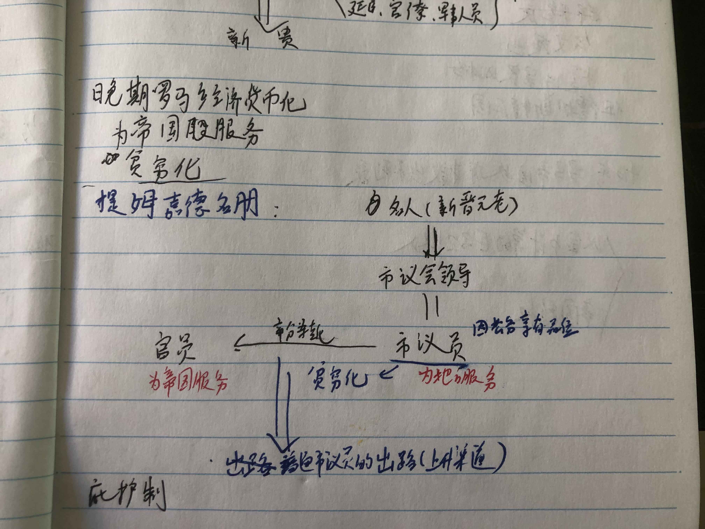
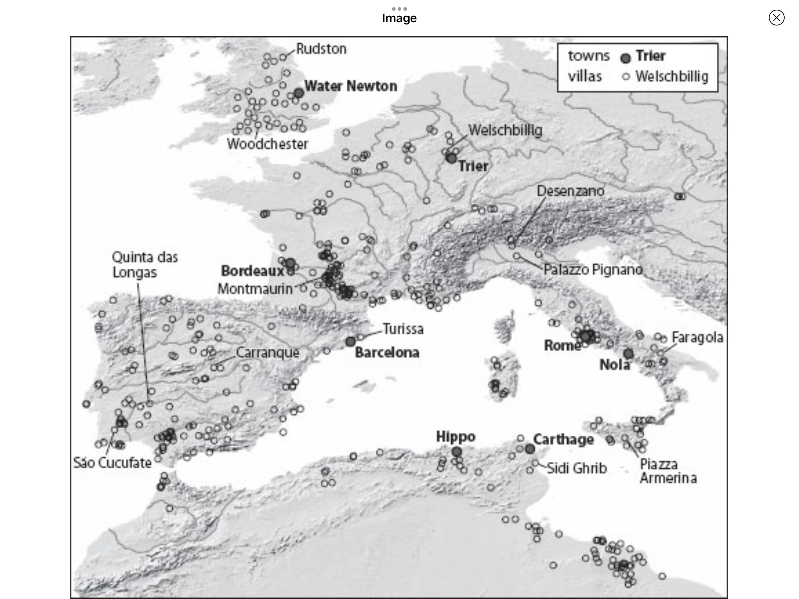
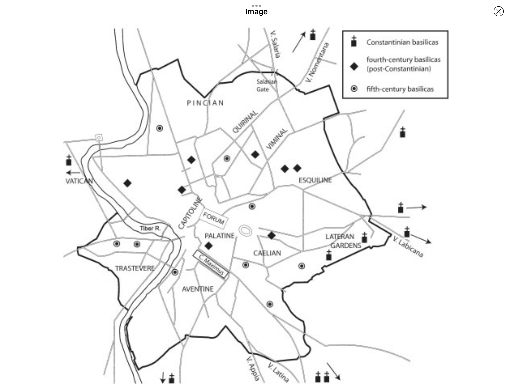
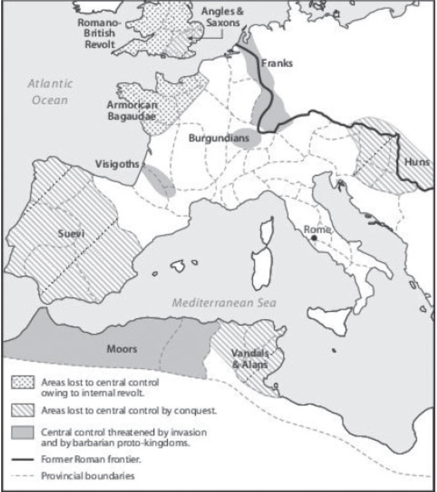

# 穿过针眼

甲骨文 抽丝读书会 2022.11 共读活动

## Basic Info

**Subtitle**: 财富、西罗马帝国的衰亡和基督教会的形成，350 - 550年

**Author**: Peter Brown

**English Name**: Through the Eye of a Needle: Wealth, the Fall of Rome,  and the Making of Christinanity in the West, 350-550 AD

## 导读

[古代晚期](https://en.wikipedia.org/wiki/Late_antiquity)

**20世纪的几位重要罗马史家**：[亨利·皮朗](https://en.wikipedia.org/wiki/Henri_Pirenne)，[道普施](https://en.wikipedia.org/wiki/Alfons_Dopsch)，[罗斯托夫采夫](https://en.wikipedia.org/wiki/Michael_Rostovtzeff), 未把基督教兴起有效纳入罗马帝国衰亡原因的讨论。

Brown 的主要著作

* 奥古斯丁传 *Augustine of Hippo: A Biography*

  * 布朗于此开始古典晚期的研究
  * 关心作为“历史中的人”的奥古斯丁

* 古代晚期的世界：从马可·奥勒留到默罕默德 *The World of Late Antiquity* 

  * 1969，1970年，布朗开了两门课：“拜占庭、波斯与伊斯兰的崛起”和“从马可·奥勒留到默罕默德的社会与超自然世界”，为本书核心内容的来源。

  * “古代晚期”术语的来源

  * > 这本书是一项关于社会和文化变迁的研究。我希望读者读完本书后能够在这些问题上有所心得：**古代晚期的世界（大约从公元200年到700年）**在什么意义上不同于**"古典"**文明；造成这种不同的原因是什么；以及这个时代发生的迅猛变革又是如何决定了西欧、东欧和近东之后的不同演进路线。

  * 以奥勒良皇帝为起点，以伊斯兰阿拔斯王朝的崛起为终点。皮朗：“没有默罕默德就没有查理曼。”

  * 社会革命（西罗马灭亡，蛮族与伊斯兰崛起）和精神革命（基督教信仰主导地位的获得）之间的联系。

* 圣人在古代晚期的兴起和功能 *The Rise and Function of the Holy Man in Late Antiquity*

  * 社会权力的**人格化**：古典晚期不同于之前古典时代和之后中世纪的重大特征

  * 5、6世纪大量离群索居、实践苦行生活的基督教圣人（holy men）出现在地中海东部，被各社会阶层尊敬和崇拜。

  * 在小地产趋于主流的东部省份，尤其是叙利亚，圣人代替撤向城市的大地主，充任村庄和小农的庇护人（patron），在“小世界”的内部作为仲裁排解纠纷，同时承担与外部世界沟通的职责（如协商税额）。圣人充当了世俗权力和教会的**中介**。对普通市民，圣人是**“职业基督徒”**，是能够提供可信的具体生活指导的导师。在一个社会高速变化、各种制度性规则严重动摇的时代，脱离了家庭和经济关系的圣人，作为“身边的陌生人”或“身边的他者”，以神圣人格的形态集各种角色于一身，协调了各种相互冲突的利益和传统，成为串联古代晚期社会的铰链。

  * > 古典时代唤起的是**大型庙宇**的意象，中世纪则是哥特风格的**教堂**。在两者之间的时代，激发想象的则是**肖像**：圣人的圣像、哲学家严峻的面容、壁画和镶嵌画上成排的凝视前方的面庞......圣人的兴起和古典制度的销蚀同时发生；圣人的衰落——或者说圣人上升轨迹的趋平——和一种新的共同体权威意识的重新确立同时发生。后者的预表，在东部帝国，表现为5世纪晚期和6世纪城市的集体意识和风纪的显著复兴；在西部，表现为西欧城市中围绕着古老死者的墓穴形成的修道院和教会等级体系的最终形式......这些**非人格化**的代理成了人们中超自然的承载者。从这个角度看，基督教在晚期罗马社会的胜利并不是唯一神对多神的胜利，而是"人"对他们过去的那些制度的胜利。中世纪教宗、拜占庭修道院、俄罗斯修会长老和穆斯林哈里发：所有这些都是以不同方式在一个高远的神之下尝试实现人对人的统治的直接结果。

  * 受玛丽·道格拉斯功能主义社会人类学的影响

  * 东西分途问题；皮朗命题：*在5世纪日耳曼蛮族入侵中得以保全的地中海古代文明，在7世纪的穆斯林扩张中遭到了彻底的打破；西欧由此被迫向北部内陆发展，成就了查理曼的欧洲帝国，而西欧从此走上了独特的发展道路。*

* 圣徒崇拜在拉丁基督教的兴起与功能 *The Cult of the Saints: Its Rise and Function in Latin Christianity* 

  * 东部崇拜在世圣人，西部崇拜死去圣徒的坟墓和遗骨。
  * 圣徒崇拜：由**宗教精英**（拉丁教会的主教们）引导大众塑造的一种宗教 - 社会生活形式。
  * 拉丁主教很大比例来自原来的帝国元老院阶层，集社会、宗教和文化资源为一身，承担城市/教区的领导人和庇护人的角色。控制圣徒崇拜。
  * 对圣徒的崇拜，实现了教区共同体意识的塑造，稳固了教会系统的权威，也使教会获得了一种独立于世俗政治的超自然性的权力。
  * 与东部与政教制度保持距离的圣人不同，西部世界圣徒的神圣性是一种被最大限度地结合进了教会制度的超自然力量。
  * 传统社会精英（元老 - 大地主阶层）在帝国崩坏后转入教会，引发教会“贵族化”。社会领袖从原有公共空间（城市）向新公共空间（教会）转移，自身认同发生变化。

* 身体与社会 *The Body and Society* 

  * 基督教诞生之后四个世纪内，各位基督教作家（从圣保罗到圣奥古斯丁）对身体、性、性别、守贞和婚姻等问题的不同看法。
  * 自我转化（transformation of self）
  * 对身体和性的不同态度在何种意义上对应了对世界秩序与人在其中位置的理解。
    * 东部：在上帝设定的宇宙秩序中对堕落前人类原初状态的回归；性弃绝——>拯救
    * 西部：在性本身和原罪之间建立了直接的关联；性弃绝——>**属灵**意义上死亡的恐惧

* 西方基督教世界的兴起 *The Rise of Western Christendom*

  * 古代晚期和早期中古欧洲的基督教化历程
  * 在西方最终得以确立的大公基督教，既不是唯一的基督教形态，在任何意义上也不是“最正确的”的基督教形态
  * 基督教的教义、实践和组织模式，在历史、政治和社会条件差异巨大的不同地区（西班牙、高卢、意大利、英格兰、爱尔兰等）经历了因地制宜的发展，形成了多个遍地开花、自成一体的“迷你基督教世界”。这些多样化的西方基督教传统要等到9世纪的加洛林帝国时代才开始经历整合，形成一体多元的西方基督教世界。
  * 早期中古时代，随着洗礼、忏悔等基督教实践的规范化，基督教从一种思想和信仰选择，转变成一种文明形态。西方基督教由此演变成为一种“应用型基督教”。

* **穿过针眼** *Through the Eye of a Needle*

  * 超过2/3的篇幅聚焦370 - 430之间；地理空间主要为意大利、北非和高卢。
  * **四世纪中期尚处在罗马社会、经济和政治生活边缘的基督教会，如何在一个多世纪的时间里成了聚集财富和权威的中心**
  * 传统上的决定性时间点，布朗认为并无决定意义：
    * 312 君士坦丁大帝皈依
    * 476 西罗马帝制废黜，出现权力真空

  * > 精英群体并不发明什么，他们只是将其他很多人的想法明确表达出来

  * **中间阶级**的重要作用
    * 市议会成员：承担征税等职责
    * 市民：寡头富人通过城市公益活动笼络的对象
    * 教会中坚力量：在宗教问题上持折中主义态度

  * 转变发生的线索：**财富原则的转变**

## 前言 

1 - 4 章：交代背景

5 - 17 章 人物志：[昆图斯·奥勒留·西马库斯](https://en.wikipedia.org/wiki/Quintus_Aurelius_Symmachus)、[米兰的安布罗斯](https://en.wikipedia.org/wiki/Ambrose)、[奥古斯丁](https://en.wikipedia.org/wiki/Augustine_of_Hippo)、[波尔多的奥索尼乌斯](https://en.wikipedia.org/wiki/Ausonius)、[诺拉的保利努斯](https://en.wikipedia.org/wiki/Paulinus_of_Nola)、[哲罗姆](https://en.wikipedia.org/wiki/Jerome)、皮尼亚努斯和[小梅兰尼亚](https://en.wikipedia.org/wiki/Melania_the_Younger)

17 - 24 章 奥古斯丁 vs [伯拉纠](https://en.wikipedia.org/wiki/Pelagius)

25 - 27 章 帝国的最后时光

28 - 29 章 财富对基督教性质的改变，新时代的开始  

​    

宗教赠与<——>宗教交易

**但历史的魅力也正在于此；学生发现他遭遇了一种强大到手头的任何工具都无法衡量的力量**

## 第一章：“黄金时代的财富“

### 财富、特权与权利

4世纪 非洲内陆 [马克塔尔](https://en.wikipedia.org/wiki/Maktar)铭文

财富： 土地——>金钱——>特权

进入市议会——>开始步入罗马的特权阶层，寂寂无闻和品位之间的门槛 *相当于中国的士大夫阶层*

**罗马帝国是一个“真正意义上的小政府”** ，几乎所有政府职能都下放给了地方性群体

市议会：**征税**、警力、道路维护、防御工事

正是在**征税**上与帝国权威的合作，使城市变得重要，同时把城市精英收束在帝国的体系内。

帝国---包税--->市议会---征税--->城市居民

赋税形式：货币、劳动、食物、牲口及其他有用物资

财富和“地位”是一体的，有钱人的财富来源于其特权（征税）

> 和莫卧儿印度一样，罗马帝国的生活是多姿多彩的。但如果沿社会阶梯向下，色彩很快就褪去了。

本书中关于“财富”的讨论，只影响了总人口的一小部分（市议员及以上阶层）

2世纪是个代价高昂的侥幸成就：过度建设、生态枯竭

3世纪：异常好运的时代后对现实的回归；“[三世纪危机](https://en.wikipedia.org/wiki/Crisis_of_the_Third_Century)”

三世纪危机的地方化：帝国的辽阔疆土和多样性缓冲了罗马宫廷和边疆地区重复出现的危机；很多行省毫发无损地度过了3世纪危机

西部行省公共建设放缓，公共建筑选择转向：剧院、庙宇和浴场——>城墙与防御工事

### 收获的震荡

> 每年基础农作物的收获涉及整个罗马世界，从中东地区开始，绕着地中海，在不列颠和莱茵河收尾。谷物的丰收在中东地区开始于春季，直到夏季在北欧结束。整个地中海地区，葡萄和油在晚秋和早春被生产出来。只有埃及，靠着裹挟着红土的尼罗河洪水在 6 月和 9 月的涨落，奇迹般地处在季节步调之外。

地中海地区的气候原因，粮食产量波动

人们将好收成归功于诸神/上帝的眷顾：

* 311年，多神教皇帝认为其对基督徒的破坏取悦了众神，天气变好了
* 4世纪初，一次宗教会议禁止基督徒地主请来犹太人为土地祈福
* [岁首节](https://en.subalternosblog.com/post/the-kalends-of-january-popular-culture-in-late-antiquity-1):关于当下财富和未来财富的节日：
  * 普罗旺斯的居民：在桌上堆满好东西
  * 犹太教：新年大祷告，祈祷雨露

富人比穷人更能抵御收成不稳定的风险：

* 农民大部分收成用来交税和地租，自己只剩不到 1/3 。易受风险的冲击。
* 农民受到地主的“地产管理人”（为地主收税和地租的人）的欺压
* 富人能够进入更广、更有利可图的市场，其具备长距离移动的能力
* 富人能够把粮食储藏起来，待价而沽。**粮仓**：财富的象征

### 新的“黄金”时代

四世纪：金币崇拜

[索里达](https://en.wikipedia.org/wiki/Solidus_(coin))

自上而下的金币崇拜

* 皇帝：通过金币赏赐官员与军队

* 官僚系统：坚持尽量用金币收税

* > 那些能够搞到金币的人，比那些财富只能由贬值的铜币或自己土地上未售产品构成的人处于更高的社会阶层

* 低层公务员：用金币收费，获得薪水
* 市政议员：尽可能向纳税人征收金币，或将征收的粮食换成黄金
* 元老们有数量惊人的黄金，巨额的收入

### 行省中的有钱人

本小节论述了 Brown 对罗斯托夫采夫观点的异议：

1. 小地产而非大地产，才是晚期罗马乡村最显著的特征
2. 几乎没有证据表明，农业劳动者越来越贫困匮乏
3. 罗马农民并非农奴，强制依附制度不常见
4. 地主“乡村化”并不显著

### 新“黄金时代”的精英

庞大的中间阶层：行省地主

罗马西部地区上层阶级大洗牌：君士坦丁与其继任者向行省中的市议会精英（小地主）与帝国官僚示好；元老院贵族的地位受到巨大挑战

新阶级：（元老院头衔）“名士”（vir clarissimus）

新人开始进入帝国核心

皇帝和宫廷开始决定社会阶层结构：帝国特权、索里达、帝国服务

旧贵族的“贫穷化”：失去地位和权力

### 庇护制

大庇护人通过举荐信编织关系网

年轻人通过庇护制上升

> 4 世纪存在太多庇护人，来自彼此间有潜在冲突的群体。不再存在一个单一的庇护链，能够从上到下地满足一个单一、固定的群体。因此，对于很多追求成功的人来说，现实已不再是“条条大路通罗马”了。

### 地方富人的“绚烂”

新贵们开始穿新潮的服饰：宫廷风格、军队风格、蛮族风格

上层女性大量使用珠宝做装饰

使用一种在帝国范围内通用的（建筑、装饰）语言；模仿皇家/罗马大庄园风格

## 第二章：“本分得体”：拉丁教会的社会形象，312 ～ 约 370 年

**时间范围**：君士坦丁的皈依 —— 安布罗斯当选主教

**”过渡时代“**

### 多神教世界中的基督教

**本节任务**：

* 对君士坦丁在 312 年皈依的性质和含义给出说法
* 确定基督教在 4 世纪上半叶拉丁世界的社会地位

**关于君士坦丁的皈依，布朗的观察与观点**：

1. 当时基督教远未成为主流宗教，很难说君士坦丁皈依是出于政治上的算计
2. 从超自然意义上来说，作为一个具有卡里斯马气质的统治者，君士坦丁选择了一个”又大又新“的新神祇作为保护神。基督教上帝是个具有超越性，同时和过去没有瓜葛的全能神灵
3. 君士坦丁给予基督教神职人员以特权与关注，来确保从上帝获得持续的保护

**关于当时基督教的社会地位**：

1. 帝国的非基督教臣民基本上未被皇帝的皈依波及；罗马帝国西部还是个多神教主导的世界；围绕君士坦丁堡城建立的帝国东部省份成了一个“基督教实验特区”。
2. 当时的基督徒能够想象的是“一个存在于（社会）世界各个角落的基督教，但并不是一个完全基督教化的社会世界。
3. “**两级社会**”：罗马不是一个基督教帝国，新兴的基督教信仰只是出人意料地在帝国里变得突出起来。在这个帝国里，基督徒也只是期望（其他人也如此期待他们）仅仅作为一个享有特权的少数派存在。

### 基督教和特权

免税和免除劳役的特权

教会已具有特权，但还未具备相应的**真实社会权力**

### 基督教与市民

[A.H.M 琼斯](https://en.wikipedia.org/wiki/A._H._M._Jones)：**基督教的主体力量来自城镇的中低阶层，包括体力劳动者、职员、店主和商人。**

曾经的学术主流观点：晚期罗马社会出现急剧的两级分化，中间阶层消失

近年的研究：中间阶层（贸易行会成员）在晚期罗马城镇中依旧扮演非常重要的角色

晚期罗马的基督徒墓地遗址，墓主多为上述中间阶级

富裕市民：

* 被吸纳进入市议会，来承担收税、执法和维持秩序等（灰色）职责。
* 进入教会，成为神职人员。目的：逃避公职，确立自身在教会中的地位

4世纪早期基督教会众看起来主要由中等富裕的市民构成

### 基督教赠与和教会的财富

\* 这节有点没读懂

中等富裕教众捐赠：[阿奎利亚的提奥多卢斯教堂镶嵌画](https://visitworldheritage.com/en/eu/archaeological-area-and-the-patriarchal-basilica-of-aquileia-italy/f903e5e3-90b8-43e1-8202-b09815a9da9a)

敬献上帝与施舍穷人同等重要

### 教会中的捐赠

[居留良主教](https://en.wikipedia.org/wiki/Cyprian)

**施舍是教会“活力”的秘诀所在，它展示了，上帝的精神在社区中发挥作用**

布施给信仰坚定的穷人

帮助教友

**布施有助于弥合基督教社团内部的社会裂缝**

居留良要求有钱的教众完完全全把钱花在他领导的教会上

通过施舍来赎罪

居留良强调内部团结，主张只资助基督徒穷人

教会由此积攒大量财富

帝国对教会的职责的要求：

* 敬献上帝
* **资助穷人**

神职人员虽享有特权，和真正的社会领袖相比，其社会地位依旧等同于穷人，被要求行为”本分得体“

### 教会里的富人，350年

有钱人/律师/前行政官员“空降”主教职位

信基督教更易受到基督教皇帝（宫廷）的青睐

> 这个社会革命无异于对传统精英的一次重构，其方法是确保指向宫廷的道路前所未有的多，而指向传统的社会权力中心的道路前所未有的少。

成为基督徒对上等人来说意味着什么：

* 打破社会边界，等级感松弛的氛围，“**一个等级感没有被废除但被消音的地方**”
* 道德上的严苛与一种从常规世界的重负中获得解脱的感觉的结合，确保了基督教会被一些人看作慰藉之所和安全阀
* “换种活法”，教会提供了一种高贵的、道德上令人振奋的，甚至是令人激动不已的反主流文化生活试验的氛围

古代晚期存在大量家庭教会以及私人的基督教崇拜，基督教的形式多种多样

### 君士坦丁体制在西部世界的终结

帝国变弱了，也被切分了。皇帝给予基督教会的支持变少了。

被君士坦丁体制抑制的宗派主义者，在有钱庇护人的支持下，开始活跃起来。

**阿里乌斯派论争**

[普里西拉](https://en.wikipedia.org/wiki/Priscillian)、[马丁](https://en.wikipedia.org/wiki/Martin_of_Tours)以及[安布罗斯](https://en.wikipedia.org/wiki/Ambrose)等激进派的上台，标志着拉丁教会“本分得体”时代的终结

*TODO: 参考《基督教史》，更好地理解这段历史*

## 第三章：“对城市的爱”：古代世界的财富及其使用

### 赠予之争

**两种赠予方式的竞争**：针对城市的传统慷慨形态 vs 针对穷人和教会的基督教的慷慨形态

| 传统赠予       | 基督教赠予     |
| :------------- | :------------- |
| 理想受众：公民 | 理想受众：穷人 |
|动机：对城市的爱 | 动机：财富从此世到来世的转移，“天上的财宝” |

### 关于财富的常识

> 我不知道为什么，贪婪对人心有如此强的效果，以至于所有人（更确切地说，是几乎所有人）都希望在言语上称贪婪是一种罪过；但他们的实际行动表明，贪婪是他们特别的软肋。

当时的普遍“常识”：贪婪是坏的

[克利福德·吉尔兹](https://en.wikipedia.org/wiki/Clifford_Geertz)：**一个特定社会的常识总是依赖于“一种稍加规整化的、经过考量的思想”**

> 常识宣称自己是在代表一个由有头脑的人组成的、想象的、大众的浑厚声音。常识判断并不像“公理化的理论或成体系的教理”那样轮廓清晰。相反，他们往往并不一致，具有民俗或谚语智慧的那种多义性。

“有关财富的话语”是一种“常识”，而不是一个“清晰的信条”。

古代晚期基督教作家的作品中对“财富”的话语很模糊和泛泛：

* 原因可能是无法自由议论皇帝和帝国政策（重税等），因此社会批评倾向于泛化和刻意模糊。“邪恶的富人”成为了替罪羊。

* 社会对不同群体的举止有不同的社会期待。富人：慷慨、心地善良；穷人：低三下四、心存感激。以此塑造了一种高度程式化的等级社会情境：富人以施恩和赦免的态度向低三下四，充满感激和渴求的穷人施舍。主教和修辞学家们一次说服富人慷慨解囊。

### “古时的节制”

罗马的集体记忆：罗马共和国的先贤们英雄主义式的清贫生活。财富标志着罗马德行的堕落

呼吁回到古时的节制

罗马人面对积聚巨额财富的人的不安——>将巨富（尤其是新富群体）塑造成邪恶的富人的形象

### 礼物的帝国：从庇护到“人道”

**在古代晚期，罗马帝国是通过个人纽带维系的，而这些个人纽带又通过大量的赠予来表达和巩固。**

可疑的财富可以通过慷慨的赠予洗白

赠予的形式：

* 施舍（从地位高者到地位低者）
* 礼物与恩惠的交换（地位平等者之间)

罗马政府：垄断暴力，反对奴隶主残酷压迫奴隶

奥古斯丁：慷慨的**人道**行动在教会之外是常见的。“他们采用了**人道**的对待方式，这源于共享的人类本性带来的共同纽带”

### 向城市的赠予

罗马社会把社会关系理解成无数个恳请者和施予者的正面相遇。（多神教徒/非基督徒）的善行显得零碎，缺乏聚焦

*个人理解：缺乏体系化的施舍行动*

真正醒目，鲜活的赠予行动：**向城市的赠予**：

* 修建剧场、公共浴场等公共建筑
* 举办赛会、演出等

"城市公益是希腊罗马世界最惊人、最特殊的特征之一"

对有钱人来说，针对城市的慷慨行为既是义务，也是令人愉快的事

“城市庇护人”称号

### “对城市的爱”

**敬意的交换**：

有钱人——慷慨解囊——>城市

有钱人<——荣耀地位——城市

赠予代表了“对城市和公民的爱”

通过赠予，有钱人对城市的爱被书写在了城市的各个地方，庙宇、广场、公共建筑、拱桥、柱廊......

广场中的个人塑像

**4世纪城市公益的缩水**：

* 经济衰退
* 市政建筑的倾向改变（见第一章）
* 罗马帝国的中央集权化，对上的关系变得比对下的关系更重要

### 民众和赛会

晚期罗马，城市中的公民（作为一个群体）依然扮演重要的角色。**公民**是每一个城市政体结构的内在部分

公民通过在剧场/竞技场咏唱来向统治阶级施压

演出和竞技：相对便宜，且更加醒目的赠予方式 **民众的欢呼**

### 公民资格

主教们需要说服富人改变赠予的方式，从“对城市的赠予”变为“对穷人的赠予”

**公民核心特权的资格意识**

> 社会的首要区分并非在富人和穷人之间，而是在公民和非公民之间。城市中恩主们的赠予对象是他们的“公民伙伴”，而非穷人。这些公民中可能有一些很贫穷，但穷困本身并不能让他们获得任何资格。他们接受娱乐活动、公共性的享乐（例如大型浴场），以及（在很多城市里）规模可观的食物救济，但他们并不是因为需求才接受这些。他们接受这些是因为他们是一个特权群体的成员，他们是城市的公民或平民，这是城市共同体强有力的想象的核心。爱一座城市也就意味着怀着一种“独特的情感”爱它的公民——而不爱其他人。

> 公民核心体拼命维持他们的公民认同资格，拒绝被归为寂寂无闻的一般穷人。接受食物和娱乐活动不止让他们感到舒服，还让他们感到与众不同。

公民特权：食物配给制，在荒年至关重要

“接受食物救济不会让人成为乞丐，而是会让人成为公民”

对一个城市的恩主来说，越过公民，向乞丐和城市边缘的移民显大方，是对公民的冷落，是一种令人厌恶的行为。

> 我们需要记住，在很多地区，这种对共同体的古老观念在整个4世纪甚至之后都依旧很有活力。即使在有了基督教会后，这种观念还是保持不变。以“后见之明”回顾，呼吁把慈善广泛地扩展向穷人的基督教布道，似乎表征了新的人道情感的涌现。但它也有阴暗面。它模糊了传统的界限，把贫穷作为要求富人慷慨的唯一诉求。这种新观念贬低了成千上万个人的地位，他们首先把自己看作公民，其次才是穷人。和乞丐、无家可归者以及挤进每座城市的移民一样，他们被视为与之同属困苦泥潭的一个部分。一个如此宽泛、不加区分的视野破坏了体制化的群体——恩主、市议员和人民——之间微妙的平衡。数个世纪以来，罗马帝国城市的生命力正依赖这种平衡的维持。在这种仅在穷人和富人之间二分的、灰白的、普世的全球视野，在欧洲范围内替代由公民团体的蜂巢构成的古典社会观念之前，在欧洲范围内替代由公民团体的蜂巢构成的古典社会观念之前，这个世界上一定得发生一种翻天覆地的转变（就像那些世纪里确实发生的那样。

社会模式的转变：**从”古典城市的时代“到”后罗马时代的古代晚期“**

古典城市模式最终丧失了它对社会想象的控制

## 第四章：“天上的财宝”：基督教会中的财富

### 赛会、民众和穷人

奥古斯丁：将针对城市的慷慨行为和基督教针对穷人的赠予两相并置。要求有钱的信众摒弃赛会，支持基督教慈善。

批评未触及城市配给制度

赛会 - 教会：“对城市的爱” - “对穷人的爱”

剧场是一种”反教会“（counter-church）

### 教会和竞技场：一场角力？

奥古斯丁有意将城市和教会并置，将其描述为两种截然不同、看似无法并存的赠予方式。

假象：教会与城市公益争夺有限的有钱人资源

反驳：

1. 赛会的开销对有钱人来说并不高
2. 有钱基督徒很少把两者完全对立

### 穷人和社会边界

早期基督徒需要在社会中放置鲜明的“**标记**”来增加影响力，使基督教的信息深入人心

标记：**赠予穷人**与**禁绝性欲**

> 向穷人的扩展与对守贞和独身的采纳，均被当作逆着人性的正常取向而行，两者都带着一种出格的英雄主义色彩，展示了基督教超自然的优越性，这种优越性能够激励基督徒去做像禁绝性欲和爱穷人这种非凡的事情

**赠予穷人**是一种最纯粹，最有挑战性的利他活动，因其违背罗马传统的“互惠法则”。

拉克唐修：

> 唯一真正、确实的义务就是去供养那些贫困和无用的人......必须丝毫不去期待回报......在人眼中他们可能没有价值，但在上帝眼中他们有。

早期基督教布道中穷人形象的摇摆：

* “他者”：需要冲破常识去到达的社会最边缘
* “兄弟”：邻人和同为教会成员的伙伴

制造穷人：将穷人的形象极端化，戏剧化，悲惨化，再将之强加给较低阶层的整体

制造富人：倾向于把所有富人集团的成员都塑造为极端富有

人为建构的两极分化，中间的社会媒介被隐去不谈

### 古以色列的模式

\* 这节没看懂

### 从“教会的穷人”到民众

基督教意义上穷人的重新界定：穷人不仅仅是乞丐，还是寻求正义和保护的人

基督教开始发挥与面向贫困者的慈善相比更宽广的影响

在新的“穷人”界定里，“穷人”的形象更接近城市里的平民：拥有权利，能够为了权利和公义呼号

城市中的中低阶层也因此向基督教靠拢

主教地位上升的关键：**争取到了中间阶级的支持**

### 基督教与城市：延续还是断裂

史学界的普遍观点：基督教的最终上位是因为教会成了公民生活可行的替代。强调延续而轻视断裂

### “天上的财宝”和礼物的功用

关于财富和赠予的**新模式**：

基督教会里的赠予打开了一条通向天堂的道路；“天上的财宝”

《马太福音》：

> 变卖你所有的，分给穷人，就必有财宝在天上。

*他用尘世的礼物买下了天堂*

约翰·帕里：

> 当经济关系日益与其他类型的社会关系区分开来时，哪些适合各自不同关系的交换在象征和意识形态上也更趋于分化

在古罗马，商业和宗教并非两个相互分离的领域

**新模式**将两个领域连接起来：尘世的财富 ——> 天上的财富

古罗马晚期的基督教文学大规模使用金钱和借自商业活动的意象

**大小颠倒的美学**：即使是小小的施舍，在天国中也会有超大的奖励。这种赠予观念很快广为传布。

> 这或许是因为这种观念尤其适用于一个社会来源多样化的宗教共同体。首先，它夷平了赠予者的等级区分。把财宝放在天堂成全了普通的施予者。因为礼物的报偿被认为由真正的有钱人垄断。每份礼物，无论多小，都会把天堂和尘世连接在一起。

对城市的赠予导致攀比

基督教赠予对有钱阶级来说负担轻得多。

### 假同晶现象： 转折时代的赠予

在4世纪晚期和5世纪早期，赠予的意义并没有那么清晰。

即使同样的赠予行为，其意义也在转变之中

## 第五章：西玛库斯：4世纪的罗马贵族

[西玛库斯](https://en.wikipedia.org/wiki/Quintus_Aurelius_Symmachus)：罗马传统贵族，“生活在现代的古人”

罗马城中贵族们的“贵族身份”并不完全是法律上的地位，而是一种“社会区分”。贵族们决定了哪些人是他们的同类，哪些人不是。

罗马贵族维持财富的方式是**精心计划的通婚**

贵族需要担任**公职**来使他的贵族身份圆满

贵族的晋升：行省总督（以非洲行省总督最为尊贵）——>罗马大区长官——>**执政官** 

老贵族：自认获得荣誉是理所应当的。新贵族的崛起来自于皇帝的支持，是皇帝的恩典

西马库斯留下了大量书面记录：900多封信，一系列公函以及一些演说词

公文为主，用来保持友谊、巩固同盟、获得支持、提携被庇护人的事业

元老院的“大议会”是西马库斯贵族生活的活动中心

> 正如一位法国学者的恰当评价，西玛库斯定期前往元老院，“就好像一位身体力行的大公教徒定期参加弥撒”。

新老元老之间裂痕很大，罗马城的元老院和作为一个整体的元老阶层之间的联系非常淡漠。

坎帕尼亚：老贵族的庄园与地产

> 坎帕尼亚为西玛库斯提供了“一个时间和空间上没有变化的世界的镜像”

通过书信编织了一张巨大严密的安全网

**罗马式友谊**：通过互相帮助，不断和其他人保持联系

只有到了四世纪晚期，“多神教”（异教，Pagan）这个词才开始流行。

西玛库斯不以宗教派别的眼光区分人。

> 在西玛库斯的世界里，一位基督教的主教首先是一位“热爱故乡的人”，教派领袖的身份是次要的

西玛库斯 vs 安布罗斯：是否恢复被削减的维斯塔贞女免税特权

安布罗斯刻意将西玛库斯塑造成“最后的多神教徒”，建构一种“基督教对多神教的完全胜利”的叙事

## 第六章：西玛库斯与罗马人民

**罗马城极度依赖 annona**

annona 是皇帝对罗马人民表达热爱的方式

只提供给公民，一种特权。公民有强烈的特权意识

皇帝离开罗马之后，罗马城被托付给官员和贵族。罗马大区长官和元老院被保留

50万人的城市，警力不足

“**贵族统治的危险实验室**"

西马库斯通过游说保证罗马城有足够的粮食运达

> 西玛库斯在他的书信中表明，每年送抵罗马城的供给事关一个一年一度的奇迹——由游说活动的奇迹促成的组织活动的奇迹。这种游说活动把皇帝（而不是神灵卡斯托尔和波吕克斯）当成了真正的“神”，正是他平息了波涛，并且把食物带给了罗马。

罗马公民享有“**暴动权**”：有人说西玛库斯的父亲不肯低价出售葡萄酒，宅邸被罗马人民焚毁

西玛库斯需要维持和罗马人民之间的关系：举办大型赛会

> ......赛会是测试一位贵族的影响力的时刻，它们是贵族的办事能力最重要的表现。只有真正的伟人才能够举办真正伟大的赛会，这就是为什么西玛库斯希望人们知道他是“为了罗马城而贪婪”：确保罗马的平民获得最好的待遇，就能够展现他的财力和影响力。

对精心编织的关系网的使用

> 无论是身居高位者还是地位低下者，西马库斯几乎把机会给予了每位通信者，让他们兑现自己的友谊，借此来为他提供一些帮助——为他的筹备工作效劳，提供一些在高层或者远方的个人力量——那将会使他的伟大事业更加光彩夺目。西玛库斯给了他的通信圈子一个机会，让他们有机会作为一个阶层来为他们之中一位成员的荣耀参与其中。

402年，西玛库斯去世。**被上层贵族放弃的财富流入了教会**。安布罗斯、奥古斯丁和诺拉的保利努斯等有治理经验、高水平文化和（或）巨额财富的人，进入教会上层。

> 有一种生活方式的力量，只有像安布罗斯、奥古斯丁和保利努斯这样的基督徒在（多少有些不可信地）宣称它将要过时了。西玛库斯绝没有过时，他并不是任何东西“最后”的代表。相反，他表明了一种社会秩序的韧性，这种社会秩序仅仅是在最近才给基督徒流出了一席之地。这些新来的基督徒才是陌生的事物，相比之下，西玛库斯就像熟悉和可靠的老石头，我们仍然能够从中读到古老的敬语。西玛库斯代表了这个世界运转的方式。在整个西罗马帝国的城市和庄园里，大多数有钱人仍然希望成为西玛库斯这样的人：一位属于他自己的城市的人，怀着”热情的罗马之魂“。

## 第七章：安布罗斯及其教民

安布罗斯：

* 约370年 以埃米利亚和利古里亚联合行省总督的身份来到米兰

* 374年 当选米兰主教
* 378年，亚得里亚堡战役，东部帝国军队主力覆灭，蛮族控制巴尔干，与意大利仅阿尔卑斯山之隔
* 384年 劝阻瓦伦提尼安二世接受西玛库斯恢复维斯塔贞女特权的陈情
* 385-386年 拒绝将米兰的教堂让给瓦伦提尼安二世的阿里乌斯派随从
* 391年 让狄奥多西皇帝为塞萨洛尼卡的屠杀平民事件悔罪

* 397年 去世

**拉丁主教破天荒地以高昂姿态直接与皇帝打交道**

“（安布罗斯）得到许多大人先生的尊敬” —— 奥古斯丁

安布罗斯：

* 拉丁西方教会首位贵族出身的主教
* 首位投身派系斗争并努力使自己接近权力中心的主教
* 意味着尼西亚激进派的胜利
* 基督教会的社会形象开始变化

基督教会：“都市绿肺”

> 在一个精英阶层与次精英阶层已严重分裂且相互争斗的社会中，教会可以为那些有不同社会背景的团体提供汇聚一堂的场所，而社会地位的强硬界限（在外部世界明显地划分人等）将在教会之墙内有所缓和。

罗马城贵族与平民关系恶化

米兰：

* 没有根源深厚的市议员阶层，不存在强大的贵族势力
* 由普通民众组成稳定阶层，巨富（来自于异乡，根基不深）和穷人都较少
* **教会更易从米兰吸纳教众**

385-386年 拒绝皇帝把教堂让给其阿里乌斯派随从的要求

* 米兰大教堂由皇帝君士坦提乌斯二世所建。拒绝需要勇气
* 安布罗斯动员群众进行示威
* 安布罗斯带领人们吟唱《诗篇》，并向信徒们介绍自己创作的用以解答神学问题的歌谣。 

**《论义务》**：

* 对标西塞罗的《论义务》
* 总结自己的15年主教生涯
* 希望可以引导他手下的主教和神职人员们的行为。
* 对神职人员“绅士化”（出身市议会上层的较富裕者）的期望

罗马宫廷开始在米兰频繁居留。沿线城镇开始繁荣，来自宫廷的新财富开始流入城镇中的基督教团体 

对”**基于稳定的和谐**“的关切

* 西塞罗：团体忠诚度与凝聚力的问题。罗马同胞间的纽带，共和国公民的义务是团结的动力。[^1]
* 安布罗斯：强调大公教会的凝聚力。大公教会是“新的共和国”

**关于塞涅卡** [^2]

## 第八章：安布罗斯与意大利北部

### "贪欲或是渎圣"：意大利之弊病

4世纪80年代，由于帝国宫廷迁来，意大利北部金融繁荣时期

米兰一度成为帝国首都

对当时很多人来说更严重的问题：**诸神不再眷顾罗马**

多神教信徒：罗马帝国的衰落是基督徒的渎神行为使罗马失去神灵庇护所致

安布罗斯：将”**宗教危机**“转为了”**社会关系危机**“，主张罗马的衰落是由于大地主的贪欲、掠夺和道德败坏

384年 罗马帝国歉收，罗马面临饥荒的威胁。西马库斯被迫驱逐了罗马城中的所有外国人，以确保只有城中的在籍公民能获得食物：

* 西玛库斯主张，主要原因是取消了供奉维斯塔贞女的仪式，失去了诸神的庇护

* 安布罗斯：将该事件描述成一场由世俗利益冲突导致的经济危机（大地主借机囤积居奇），将西玛库斯认为的原因排除在外

### 社会评论家安布罗斯

**《论拿伯》**：取材于亚哈王与拿伯葡萄园故事的布道词。亚哈王为占据拿伯的地产而将其害死。安布罗斯借此抨击米兰富有地主。

> 拿伯之事本是古老传说，如今竟已成为日常之事

安布罗斯渲染了富人之恶行（兼并小农土地，驱逐居民，暴力.....），塑造了一幅冷酷、悲惨的农村图景

这种图景并非完全真实，事实上考古学家发现了当时有“大量增长的乡村活动”

真正的问题：地主依靠持续而粗暴的方式动员劳力

但土地兼并并不是4世纪出现的主要问题，安布罗斯的描述多少有些时代错位

安布罗斯看似致力于探寻”真相“，但他所追求的”真相“不过是一幕戏剧，某种程度上是一种“陈词滥调”。

**安布罗斯希望借助“贪婪富人”与“受难穷人”的一般形象使他人接受其主张**

通过这种方式，安布罗斯持续推动并不断增强米兰基督教徒团体观念

安布罗斯将罗马民众塑造为古老选民以色列人的继承者，而将自己塑造为古代先知的形象

### 富有基督徒的义务

> 上帝令你富有并非恶事一件，此恰是莫大幸事。你当通过慈善之举寻求赦免罪行的良方。

通过对穷人行善举，向教会行捐献，富有基督徒可以免受内心愧疚的侵扰，免受民众的批判

### 安布罗斯及其可行权限

布道词的实际作用：**为安布罗斯和与他类似的主教介入社会事务提供便利**

“上诉革命”：皇帝鼓励下层民众的上诉和检举行为。中央政府通过对一些偶然而引人注目的请愿行为的许可，实现对遥远行省事务的监管。

在布道之外，安布罗斯游说当权者，展现“基督徒的善意”

这个时代，安布罗斯还无法对罗马帝国的税赋和财富体系进行批判。

> 不过从某种程度上说，正是安布罗斯的事业使他自己变得“不合时宜”。他在米兰的事业如高层建筑的地基一般，虽然不再令人关注，却有着决定作用。安布罗斯的努力不仅使帝国西部的一座重要大城市处在不可侵犯的聚合力中，同时为其他西部城市即将进行的事业开创了成功的先例，并提供了实现这一伟业的方式。我们看到，安布罗斯使他设想中的、穷人与其他民众间差异模糊的社会团体成为现实，并将穷人纳入大公教会之中。另外，安布罗斯还以实践表明，富人对穷人的关怀是全体基督徒团结一致的必然结果。最后，同样重要的一点是，安布罗斯所展现的紧密团结的米兰大公教会团体揭示了使人类社会成为整体的核心要素，即各自分散的人类个体能通过皈依大公教会重获久违的团结。正是在这种大期望之下滋生的对社会问题的关切，使安布罗斯塑造出了一套话语。这套话语被证明很能适应一种终于敢第一次以“主流信仰”自居的宗教雄心，此时，蓬勃发展的基督教会正如“渐圆而明亮的皓月”，高悬于罗马世界的上方。

## 第9章：奥古斯丁：事业、庇护与宗教联系，354 - 384年

### “有产市民”：资源有限的市民

奥古斯丁的足迹：非洲——>意大利——>非洲

本章：迦太基——>罗马城——>米兰

384年 通过西玛库斯的引荐，奥古斯丁从罗马来到了米兰，成为一名修辞学教师

奥古斯丁和西马库斯、安布罗斯不在一个阶级，来自“灰色地带”

出身塔加斯特（Thagaste）的市议员阶级。小地方的市议员阶级年轻人想走出家乡的“小金字塔”，走向更广阔的天地

被塔加斯特当地富豪罗马尼亚努斯（Romanianus）资助。塔加斯特版本的西玛库斯

### “亲密关系”：庇护、友谊与集体的形成

> 对于这个小城市市议员的儿子来说，与无所不在、决定乾坤的庇护制相比，财富与贫穷的问题已经隐入后台

对低层出身的奥古斯丁来说，社会是靠庇护实现自上而下的分层的。

>  那并不是一个贫与富的世界，而是一个庇护人与朋友的世界

因而奥古斯丁强调友爱、信任与齐心协力

> 对他来说，人类社会并不是靠某种广泛而原始的纽带联结起来的；社会必须要有凝聚力，靠的只是人类情感的自由而危险的博弈；每一种友谊都是一场赌博；每个团体都是脆弱的，都是意志博弈的产物；社会是充满危险的，它能够创造并维持团结，只有依靠微妙的共同情感和相互忠诚。

强调**友谊纽带的质量和坚韧度**，以及**共同的宗教热情**

庇护到友谊的转化是最容易发生的。庇护人与门客之间一定程度的不对等性可以通过“友谊”消除。小圈子的“友谊”可以超越社会阶级、财富等现实问题

### "慧明之子"：摩尼教徒奥古斯丁

373 - 384年 奥古斯丁是摩尼教派成员

摩尼教4世纪在非洲流行

自觉为基督教的改良者

由一个个小型单元组成

一种紧密的宗教版本的“**友谊**”

摩尼教团体的成员之间通过精神性的强大纽带结合在一起，共同拥有“**慧明**”

## 第10章：从米兰到希波：奥古斯丁与宗教团体的建立，384 - 396年

### “垂涎功名”：米兰，384 - 386年

384年末，奥古斯丁前往米兰

此时罗马帝国三分，意大利半岛较为弱势

开始追求功名利禄，抛弃“发妻”

哲学团体的计划破裂

### “鲜亮明澈的善人们”：从加西齐亚根到塔加斯特，386 - 388年

386年夏 接触新柏拉图派哲学 决定过上独身生活，接受大公教的洗礼

386年 在加西齐亚根（Cassiciacum）退隐，“赋闲”，投身思想性的追求

《对话录》：普及知识的大胆尝试

放弃了横向性的紧密结合方式，转向一种更严格的金字塔模型，一起追寻“至高之美”

### 通向守贫的道路：从意大利到塔加斯特和希波，388 - 391年

388年 小团体回到塔加斯特

自力更生的小团体，像使徒一样生活，“耶路撒冷团体”，修道团体

共享财产

奥古斯丁变卖家产

追求“知足”，“守贫”，按共享的财富量入为出

奥古斯丁向非洲大公教会的主教们示好

391年，希波教会强迫奥古斯丁当了司铎。在希波建立了修道院

## 第11章：“一种共同的生活，共享神圣的天上共和国”：奥古斯丁在修道团体中论公与私

### 希波的修道院

396 奥古斯丁成为希波主教，将若干修士带入主教府，同吃同住，成为他的贴身手下

沿袭罗马的庇护制，给北非各地的城市推荐主教。

血缘的纽带

397 《奥古斯丁修道规章》：《院规》+《规程》

和后来的修道院不同，奥古斯丁的修道院并非与世隔绝

### ”你对公益的关注越多......你就知道自己进步越大“：奥古斯丁修道院里的富和穷

到了希波，修道团体第一次有其他阶级的成员加入。

回避修道院内部的社会差异问题

”团体至善大于各人的需求“

### ”共和国“：奥古斯丁、西塞罗与公益

奥古斯丁和安布罗斯对西塞罗的”凝聚力“观点不同。

”私欲“和”公益“的对立与张力

*存天理，灭人欲*

西塞罗认为财富是贵族与生俱来的，剥夺财富等于剥夺其有力的个性与品质，贵族靠这些来为共和国服务

奥古斯丁倾慕共和国早期英雄安于”贫穷“，为全体人民的利益献身，将城邦放在私利之上

普罗提诺：“私”总是和具有强烈贬义的善的“匮乏”有一定联系。呼吁灵魂“回归”原初的整体

奥古斯丁：魔鬼和亚当用自己的私欲和上帝的公共法律对抗

奥古斯丁在修道院内与“私欲”斗争。

> ......私己之爱完全无法与朝向更高、更广阔事物的爱相比拟......在得到上帝的时候，人类就得到了一种极大的丰富，那是他们的私心想要占有的东西所无法比拟的。

“**精神共产主义**”

### “沐浴共同之光，对于我们大有裨益”

“神圣共和国”的胜利只有到了天国才会实现

## 第12章：“那些，的确，属于尘世”：奥索尼乌斯、庄园与财富的话语

### 友人殊途：奥索尼乌斯与保利努斯，394 - 395年

[诺拉的保利努斯](https://en.wikipedia.org/wiki/Paulinus_of_Nola)

巨富

奥索尼乌斯：劝阻

奥索尼乌斯河保利努斯都来自基督教家庭。

保利努斯从巨额财富的“意义”和“**神秘性**”中解脱出来

### “我统领帝国”：戴切米乌斯·马格努斯·奥索尼乌斯与特里尔的帝国

奥索尼乌斯

高卢世界：中心是**特里尔**

4世纪罗马帝国的中心

黑门：阿尔卑斯山以北现存的最高罗马建筑。

特里尔：不临地中海的欧洲地区的首都

4世纪，税收和物资大规模流向特里尔和莱茵河的驻军

369年 奥索尼乌斯在特里尔遇见了西玛库斯

奥索尼乌斯出身阿奎丹的低等贵族，与当地立足更稳的地方贵族联姻。直到365年，奥索尼乌斯还在波尔多

波尔多：大西洋地区的特里尔。贸易中心

奥索尼乌斯被瓦伦提尼安一世赏识：

360s 成为格拉提安的老师

375 成为帝国法官

377 就任高卢大区长官

378 - 379 管辖范围扩大到非洲与意大利

379 成为执政官

格拉提安提拔奥索尼乌斯出自政治目的：安抚罗马贵族，同时挡住他们进一步的权利

> 他是古典学教师，支持罗马元老贵族自命全身心倾注的理想；他是看重赋闲与古典文学熏陶的整个阶级的理想自我。但同时，奥索尼乌斯并非罗马城的罗马人，他只是个老师，而且不过是个地方名流

### ”我的小家业“：奥索尼乌斯及其财产

383年 格拉提安被杀，特里尔失陷；奥索尼乌斯回到阿奎丹

《我的小家业》（一座大庄园）

反映了当时社会对奥索尼乌斯这个阶级的人“应有”的财富的认知

使之看起来像”祖传“的家业

### ”让我们，幸运儿，享受美好生活“

#### 西欧和北非的晚期罗马庄园

富人的家中，色彩效果强烈

多彩大理石铺成墙面

传统观点：强调城市宅邸与庄园的布置反映了晚期罗马不加掩饰的社会分层：罗马老房子中开放的通畅空间关闭起来，厅堂与正式宴客厅成了主导，它们被打造成多彩、壮观的舞台，专为抬高这家主人的地位而设计。

实际上：有各种规模的庄园，表明存在一个分布相对较广并且内部有竞争的阶层，他们之间的收入差异大。盖庄园的不仅仅是少数特权者，暗示着广泛分布的地主阶级强大的竞争冲动

### 艺术与人生：谁是庄园主人

传统观点：晚期罗马镶嵌画和银器上的刻画的华彩景象，常常被认为是罗马晚期穷奢极欲，社会堕落，等级分化严重的证据。**认为大庄园已发展成了自治单元**，如同中世纪一样。

四世纪的情况并非如此。奥索尼乌斯等人财产可观，但并不曾独立于庄园所在地附近的政权与城市。地主们维护财产，靠的是和政治和经济中心波尔多之间保持紧密联系。地主们在城市与庄园之间来回移动。

高卢地主的财富和地位来自于帝国统治的活力

大庄园只出现在“帝国走廊”（高卢西南部、西班牙部分地区、特里尔周边、不列颠南部）

> 庄园从来不是纯粹的经济中心，也不是封建城堡的原型，而是一座丰碑，它向邻居们发出”主人来了“的消息。在这些4世纪四散的流动精英中，无论是在不列颠，还是在高卢和西班牙，从来不缺要向大家迫切宣告自己已经到来的人。

### ”拿走！“：丰盈之像

晚期罗马卧榻的形状起源于户外野餐的靠垫摆放。象征着某种对土地丰产的崇拜

水产海鲜的镶嵌画：海洋的丰盈比大地更加纯净，更加无条件

（镶嵌画中）刻意忽略获得丰收所需的劳动

象征大自然对土地拥有者的慷慨和顺从：各种物产

表现四季的镶嵌画：预示丰饶将反复再现，恒久不衰

4世纪的镶嵌画：看不见丰产相关的诸神，“自然”本身成为了力量的源泉

### “祝您健康，洗浴愉快！”：快乐的肉身

> 晚期罗马人认为，人的肉身是世界这个伟大的宏观宇宙，即整个物理宇宙，在极私密的状态下表现出来的微观宇宙。让肉身脉动的正是使星体律动的力量

富人把身体表现得极其快乐。个人健康、充满力量的身体跟自然界——他或她自身财富的来源——一样，都参与着令宇宙蓬勃生机的律动。健康听命于富人，穷人的厄运不会落在他们头上。

推崇身体要充分沐浴：成功人士的生活方式，能量与好运的个人化（躯体化）

4世纪富人热爱兴建私人浴池。

“建私人浴池常常仿佛是某种给城市的施舍，由庄园主主动提供给有限的人民——他的门客与朋友们。”

打招呼用语：“祝您健康，洗浴愉快！”（Salvus lotus）

### 财富、宇宙与诸神

晚期罗马关于丰盈和监控的用语有宗教性，带有神秘的战栗感

物质世界所蕴含的焕发生机的能量

对富人来说，上帝是个遥远的，高高在上的神，属于彼岸。现世则属于自然本身的超自然力量

奥索尼乌斯的老派基督教：神是非物质的，应该只在精神上崇拜。物理宇宙本身则不受干扰。敬拜基督，但将其力量局限在超现实的领域。

尘世则是属于那些古老的神话，精灵的

4世纪晚期帝国流行占星术

占星家费米库斯：

### 活生生的神话

4世纪艺术品中缺乏明确的宗教标识，即使是在神话场景中

强调的是财富和丰盈本身

XP符号经常与象征丰盈的其他符号出现在一起

四世纪富人共同的视觉文化：古典神话

暗示主人是他们所在的时代“**活生生的神话**”

神话被“现代化”，用来象征主人的品质

[普罗耶克塔首饰盒](https://www.britishmuseum.org/collection/object/H_1866-1229-1)

 

**独特的基督教——君士坦丁与他的继任者那个时代的基督教——与在那时看来不可撼动、不成问题的古典传统暂时共存**

> 奥索尼乌斯是他那代人的基督教的真挚代表。富人、多神教徒与基督徒都一样，仍对所处世界泰然自若。但是，奥索尼乌斯以及许多跟他一样的人都无法预见，在他们的基督徒同道中，一队人数虽少但敢于直言的人之中会出现对财富的新看法，这一新看法给整个尘世投下了冰冷的阴影。那些听取基督教苦行者传递信息的人，无法再将财富是为想象中来自宇宙丰盈的毋庸置疑的溢流。“世界”是黑暗的地方，他的种种美丽是诱惑之源。财富是“污秽”，它不是半神圣的大自然蓬勃生机的副产品，它是负担。灵魂但凡要脱离枯燥乏味的物质性，飞升去加入“在空中”的基督，就必须摆脱它。财富可以被容忍的唯一条件，是它不断地上升（通过虔诚的举动），进入静默的，看不见的，位于恒星外的世界。像《福音书》中的年轻的富人一样，必须面对针眼。”地上的财富“必须被放弃掉，只有这样，它才会成为”天上的财宝“。

## 第13章：“告别极富”：诺拉的保利努斯与放弃财产的声明，389 - 395年

### “古老的保利努斯家族，世袭领地被上百个（新）主人瓜分”：保利努斯、弃财与内战

奥索尼乌斯等高卢的地区贵族们受到了政权震荡的冲击

**以各自的庄园和共同的阶级文化为标识维护团结**

背弃生活方式 = 背弃阶级和所在的地区

* 389年 保利努斯搬到西班牙埃纳雷斯堡（Complutum）定居

* 394年 丧子，决定持戒，变卖家产。在巴塞罗那被祝圣司铎

* 395年 来到坎帕尼亚，定居诺拉

奥索尼乌斯悲叹，劝阻保利努斯放弃财产

帝国政权更迭，奥索尼乌斯需要保利努斯来在新政权获得话语权

保利努斯担心自己会被新政权掠夺

### 百基拉之阴影[^3]

极端苦行主义者

时间线：

* 380年 争端
* 381年 百基拉成为阿维拉主教
* 384-386年之间 百基拉被处死

百基拉代表了不满足现状的富有基督徒的希望，获得了亲尼西亚派的支持

4世纪西班牙地区的对立：**低调克制的教会** —— **富丽堂皇的庄园**

教会受到社会中层人士支持

主教不能接受有钱人信徒们不去城市的主教堂参加礼拜，反对有钱人在“[四旬期](https://en.wikipedia.org/wiki/Lent)”依旧待在庄园里

> 他们从最坏处怀疑那些在四旬期仍然“流连于庄园”的人，这样的人有可能将这个原本全城的忏悔季（所有阶层的人都参与，并由普通人主导）变为贵族“赋闲”的宗教代名词——在这段时间高度专注，离城而居，与精挑细选的家人、朋友为伴。而更糟糕的是，在这一“赋闲”期间，男女有可能随意混杂，亦如在名流高贵的家庭晚会上。这样的小团体还可能邀请受人追捧的导师莅临指导，而所教内容是否正统却不得而知。于是，缺席城市礼拜典礼、在乡村别院举办以富有魅力的导师为核心的私人宗教聚会（且男男女女不避嫌），是380年主教们在萨拉戈萨开会时反复讨论的两个话题

有钱人赞助非基督教的艺术，在庄园中大兴土木。主教们害怕这些人中有百基拉的追随者

当时的基督徒同样认为苦行修士为异类

苦行者和富有的追随者之间的关系常受到诟病

有人赞助苦行明星，损害普通教士的利益

百基拉的富有追随者过多，可动用的财富可观；他们将可观的财富部署于宫廷，以捍卫自己的领袖，确保其敌人获罪

保利努斯需要厘清自己对财产的态度，以防重蹈百基拉的覆辙

公开声明：自己会变卖所有，施舍给穷人。摆脱“私藏财产”的味道，给西班牙教会纳投名状。

### “一个由富变穷的人”：从阿奎丹到诺拉

对马丁、安布罗斯等人来说，保利努斯，一头非常庞大的骆驼，确实能够通过放弃财富“穿过针眼”

变卖也需要朋友的支持和经常性的打理

保利努斯看似收入不减，但财富带来的“华彩”确实已经熄灭了

过上了完全不同的，“反财富”的生活方式：

* 不再住在大庄园里；
* 不再与世隔绝，而是与穷人密切接触
* 不再乘坐豪华马车，
* 穿着朴素
* 饮食简单
* 不常洗澡

> 保利努斯渴望成为他那样的人，因为菲利克斯过着“那样一种生活，仿效上主基督在尘世的样子：曾经的富人，而今至穷”

### “走下来”：模仿基督

保利努斯关于贫穷即反财富的说法，对那个时代中与他志趣相投的人极具说服力，因为他的识别标志建立在对基督这个人的深刻认同上。

**4世纪的基督形象：他在礼敬中的形象经过精心打造，令正面临某个特定神学困境的某个特定阶层的基督徒产生共鸣。**

尼西亚派对基督解读的矛盾：基督是个不起眼的人，但同时基督又是“完全神性”的

解决方式：**上帝自己“为我们的救赎”做出了决定，在基督身上，将自己毫无保留地袒露于完全的人之软弱。**

> 如果说在晚期罗马的社会思想中，权力与财富是为了生存必须牢牢抓住的东西，那么再没有什么“走下来”会比上帝自己“走下来”——在一段时间内，放弃自己握有的权能——更令人瞠目结舌。基督作为上帝，曾是贵族中的贵族，富人中的最富。然而，以其无限的善，他出于自由意志放弃了这种财富，他将神性的光辉掩藏于人之境遇的黯淡无光之下，但那光辉依旧在那里。借用后来被纳入拉丁教会礼仪的安布罗斯圣咏的歌词：基督，投身为人，其出现就像“一位巨人，双重本质”。他出现在人间，是神与穷人的合一。

保利努斯的基督是“朴素的”，“不起眼的”，“缄默的”，“尘世的”

## 第14章：“灵的交易”：诺拉的保利努斯与财富诗，385-408年

### “马尔库斯已经向圣菲利克斯大人还了愿”：祭坛上的财富

408年 成为诺拉主教

395年，保利努斯依旧享有贵族特有的搬迁自由，不受制于任何城市、任何教会、任何常规的公共角色

建造菲利克斯圣陵：作为“还愿”

> 上帝通过菲利克斯保留了保利努斯的财富，保利努斯通过将它花在菲利克斯身上把它还给了上帝

### “我的功......由菲利克斯做“：打造圣陵

重建的菲利克斯圣陵是保利努斯的丰碑，并最终将是他自己的陵园，就像贵族们的庄园一样。

富人们修建庄园的行为背后，有着向社会宣告自己优于他人的冲动。

> ......曾经强加在世俗贵族身上的、贵族集团数个世纪来用以自我约束的禁忌全然消失了。对于投入巨款打造私家门廊，西玛库斯不得不假装不好意思，但保利努斯却大可不必。我们谈到的这个现象在不小的程度上生动反映了这个时代：当保利努斯这样的皈依者彻底摆脱来自其同僚集团的约束，将自己与财产置于上帝之手时，那种强烈的自我掌控感得以释放。他可以如他所愿，极尽奢侈，为菲利克斯而建

### “灵的交易”

保利努斯的诗歌：贬低此世的财富，暗示将这些财富存入天堂，带来的是无法衡量、难以想象的荣耀

对立面

”**灵的交易**“commericium spirituale

### 灵的交易与关照穷人：罗马，396年

基督教元老在妻子的葬礼上大摆宴席，宴请穷人。

保利努斯颂扬这种行为：

**死的财富通过成为给穷人的救济而得到救赎、获得生命**

### 富人与穷人在圣菲利克斯圣陵

菲利克斯圣陵每天都有大量穷人来寻求食物和庇护

\* 本节有些看不懂的地方

保利努斯的交易理论：**他给穷人们以物质——食物和容身处，穷人们回报以本质上非人间的祷告**

富人通过布施穷人，来“穿过针眼”

[财主和拉萨路的故事](https://en.wikipedia.org/wiki/Rich_man_and_Lazarus)

保利努斯通过布施穷人来避免故事中财主的命运

### “与上帝分享”：基督徒地主们与财富的使用

财富从尘世到天国的传递

“救恩经济学”

保利努斯劝说约维乌斯：财富来自上帝，而不是“自然之丰盈”

观念的转变，“**职务化**”：负责皇帝走下神坛。被看作上帝的仆人，以侍奉上帝为目的统治帝国

地主们为上帝代管财富，使用财富要向上帝负责

> （地主）的财富不属于他们自己，而来自上帝，但只要他们遵从上帝的意愿，就可以一直拥有它。在这个充满想象力的观点中，大自然被褪去了它自古就有的丰盈神秘性。是上帝的意志以一己之力——不是自然界半神的灵力——带来连年丰收，大自然被去神化，被灭了威风，因此，可以牢牢地留在虔诚的人主手中。

## 第15章：“源自罗马城之伟大”：罗马富人及其教士，从君士坦丁到达马苏斯，312-384年

### 舞台画般的美丽奇景：370年罗马城的府邸、郊区与教堂

富人生活在罗马众山和城郊里

坟墓沿阿庇安大道而建

350年前后，罗马城区的基督教痕迹并不重。教堂隐没在楼宇中，看起来和普通的城市住宅没有区别

郊区由君士坦丁捐赠并兴建了宏伟的宗教建筑

大型教堂：圣彼得教堂、拉特兰教堂

君士坦丁时代的罗马，基督教的恩主（皇帝）极度奢华，而教会本身却并没有真正属于自己的财产，缺乏社会地位

### “他建了冠名教堂”：罗马教会中的私人捐献与教会捐献

罗马教会财富的积累悄无声息，并不来自单个大金主，而是来自众多大体低调的人士的捐赠

“冠名教堂”的出现：个人捐建的罗马城中的教堂

> 正是通过这种教堂，在4世纪和5世纪早期，基督教由350年前后实际上的隐匿状态变成了全城上下都能感到其存在的宗教......正是在这些教堂中，罗马城找到了它众多的小保利努斯，而不是君士坦丁。

转向：富人决定把他们的钱放到教堂

一般认为冠名教堂并不直接隶属于主教，捐赠人对教堂依然有影响力

*分歧：冠名教堂的财富是否来源于平信徒的永久性基金*

### 教会与新贵

366-384年 达马苏斯任罗马教宗

**新富阶层**通过把钱与精力献给罗马教会来增加影响力

4世纪二三十年代 家族墓地出现在地下墓穴中

4世纪末 家族墓园开始围着郊区的圣体龛而建：“圣地首先是富人的地盘”

### “这个对奢华生活的炫耀”：达马苏斯时期，366-384年

达马苏斯积极吸纳低级贵族（新富）阶层：

* 相对于核心贵族更容易皈依
* 可以在城市里保留空间

传统观点：达马苏斯通过迁就贵族和元老院的传统，开启教宗与贵族之间的天然同盟

366 与乌尔奇努斯的支持者发生冲突

> 神职人员与平信徒都想要一个反映他们所在社会的特征——等级化、奋发、忠诚——的宗教，它还不带教会外世界中的等级制通常会有的种种令人讨厌的特质

教会与新富阶层的结盟

### “职务本身就有其光荣”：伪安布罗斯世界中的等级与社会

[伪安布罗斯](https://en.wikipedia.org/wiki/Ambrosiaster)

观点：

* 君主主义者，主张强硬的中央集权

* 罗马法极为重要，帝国的权威极为重要

* 等级制必要且光荣

### “很受贵族欢迎......因其职位而神圣“：墓志铭中的罗马教士

## 第16章：”在外邦唱耶和华的歌“：哲罗姆在罗马城，382-385年

### ”那需要大量闲暇、辛劳与金钱的事“：哲罗姆作为专家在罗马城

哲罗姆的履历：

* 341年 出生于斯特里顿
* 368年 在特里尔
* 375年 在安条克定居 支持尼西亚信条
* 382年 来到罗马城，达马苏斯手下。把《圣经》翻译成拉丁文。贬低同时代的人，不受欢迎
* 385年 不受重视，离开罗马

### ”圣保拉之府邸“：哲罗姆与罗马贵妇

**性**与**钱**

哲罗姆的主张：

* “封冻”性欲
* “闺房中”对《圣经》的冥思，顿悟与狂喜。

### ”沙漠钟爱那赤条条的人“：哲罗姆论财富与贫穷

认同想象中绝对贫穷的基督

空掉自我，将社会人彻底抹除，回归动物性

颂扬极端的贫穷

### ”学会神圣的骄傲“：哲罗姆圈子里的婚配策略

保拉与玛尔切拉

> 寡妇可以极为富有，她们享有父亲的继承权。寡妇越快再嫁越好，女儿们也不被鼓励过久地待在字闺中，她们被迅速推入婚姻市场，以利于一个上升中的大有前途的家族扩大经济和政治势力。在这个靠着女人的流通来运作的世界里，哲罗姆不停地鼓吹着守寡守贞——一种不流动的、献身圣教的状态。

哲罗姆反对婚姻

### ”让那帮贵族大声斥责我“：苦行的召唤与财富的流动

贞女不是基督教的专利

## 第17章：罗马与耶路撒冷之间：女人、庇护与求知，385-412年

### ”我找到了灵魂之所向“：罗马的女性与求知

罗马上流社会中很多人有强烈的求知欲

上流阶层请灵修导师有传统

杰出女性读者诞生

### ”很有钱“：儒菲努斯、哲罗姆与他们的庇护人

对哲人、解经者、灵修导师来说，书是他们最大的财产

当时书籍非常昂贵

书本制作革命：手抄本代替卷轴

图书馆数量激增

哲罗姆（以及其他修士）的悖论：

* 倡导彻底的贫穷

* 文字工作需要投资图书馆的富人的庇护

儒菲努斯（庇护人：老梅兰尼亚） vs 哲罗姆（庇护人：保拉）

### ”圣徒中的穷人“：哲罗姆与维吉兰提乌斯

教会与修士争夺捐款

维吉兰提乌斯对圣徒崇拜的反对：圣陵富丽堂皇，但圣徒并不在圣陵中

### ”切勿骄傲！你们属于同一个教会“：约维尼安对哲罗姆，390-394年

哲罗姆的苦行宣传挑战了罗马基督教团体的核心信念——不能把成员严格划分入不同等级

> 在唯一一个受洗的团体中，仅凭个人远离性生活这个长处而要求成为独立的阶层，在罗马基督徒中引起了实实在在的不安，这标志着较为老套的观念已经走到尽头。

约维尼安认为，主张守贞守寡有特殊功德的人会向基督教团体引入分裂的危险，担心在受洗的信众团体中出现二元体系

约维尼安：**教会不可分割，信徒因洗礼而平等**

> 一旦允许在基督教团体内部基于”弃绝性生活“这一简单原则产生一群精英，那么钱就会追随他们而去。习惯上用于”善工“的钱，包括给穷人的和捐给教会的，会转而支持这个受人尊敬的独立团体。 

4世纪末5世纪初，上层贵族与教会走得更近了

## 第18章：“穿过针眼”和“灵魂之财”：放弃财富、高贵性与攻陷罗马

### “穿越窄缝”：梅兰妮娅和皮尼亚努斯，405～408年

[伯拉纠派纷争](https://en.wikipedia.org/wiki/Pelagianism#Pelagian_controversy)：奥古斯丁 vs. 伯拉纠

小梅兰妮娅夫妇梦见穿过墙上的窄缝——对应圣经中的“骆驼穿过针眼”

放弃财富的原因：可能是受到保利努斯的影响

保利努斯放弃财富，建造圣陵的行为某种意义上是出于对末日将至的恐惧

### 罗马受到围困：皮尼亚努斯、梅兰尼娅和元老院：408～410年

408年 阿拉里克包围罗马

410年 阿拉里克“攻陷”罗马，劫掠

> 在4世纪70和80年代，富裕基督徒家庭处理遗产的方式是，某位家庭成员苦修、放弃财富和婚姻，这些并不影响财产传给其他继承人。

贵族放弃土地会导致奴隶失去庇护。奴隶可能加入蛮族军队，可能落草为寇

皮尼亚努斯夫妇通过皇帝敕令，使自己的财产成为一种特殊形式的皇家财产，专门用来资助穷人

408～409年罗马饥荒，元老院被迫向元老征税

皮尼亚努斯夫妇最终得以自由处置财富

### “哪个城市和乡村没有分享到他们的善举呢？”：遣散财富，410～417年

3.5万索里达给了东部的修道院

1万给了西部

1万给了地中海沿海岛屿上的修士

资助“[金口约翰](https://en.wikipedia.org/wiki/John_Chrysostom)”的支持者

417年到达耶路撒冷，加入耶路撒冷教会的穷人行列

### 从罗马到迦太基：流放中的阿尼齐家族妇女，410～413年

罗马陷落后，部分贵族撤退到迦太基

罗马基督教与非洲基督教的摩擦

> 作为基督教学者和灵修导师的庇护者，俗贵自认为与主教和教士一样有权决定正统教义的范围

德米提雅斯守贞仪式：通过正式成为贞女，退出婚姻市场，节省一笔嫁妆，摆脱门不当户不对的婚姻

### “神圣财富只有通过自己才能获得”：伯拉纠和德米提雅斯，413年

[《致德米提雅斯书》]()：伯拉纠的灵修指导：

* 人性是合理的，能够承受严格的苦修教育
* 人的心灵受其本性引到，去追求正确（性善论）
* 人自身没有什么因素、整个世界也没有什么力量，使认真的基督徒不能贯彻他或她的意识

* 圣洁只能来自人的意志，并不来自外部的“被挑选”

### “愿所有尊荣······发生改变“：伯拉纠和高贵性

伯拉纠从阿尼齐家族的血统中得出德米提雅斯潜在的高贵性

> 对伯拉纠而言，尘世的高贵与基督徒的高贵并非彼此对立：一个能够直接带来另一个

罗马贵族根深蒂固的“本性高贵”

## 第19章：消灭富人：伯拉纠派对财富的批评

### “自由意志之剑”：伯拉纠、习惯与财富的社会层面

**《致德米提雅斯书》**：聚焦“本性高贵”，回避巨额财富问题

“摒弃财富，而非拥抱贫困”

**伯拉纠认为人的意志自由，人被自身经历和习惯阻碍，而不能遵上帝的旨意去做善事**

> 习惯并非不可克服。自由意志所创作的，也能由它消除。习惯外在于一直，就像在机械的运转部分形成的铁锈。伯拉纠想教导德米提雅斯如何去掉锈迹，恢复其本性做善事的自由。

财富是“坏习惯”，是需要通过自由意志来摆脱的

### “罪恶中盛开的花朵”：伯拉纠派《论财富》和财富之源

**《论财富》**：伯拉纠派的匿名作品

* 主张彻底放弃财富

* 财富是贪婪的结果（意志的结果），财富就存在于意志之中

传统的观点：

* 财富可以被区分为“好”财富和“坏”财富，取决于动机和用途
* 贪婪是个人缺陷（好色、奢侈、傲慢、热衷于权力......）的结果
* 在遥远的黄金时代，财富都是清白的，未堕落的；基督教富人们由此心安理得地保有财富。行[亚伯拉罕](https://en.wikipedia.org/wiki/Abraham)之故事

《论财富》中的观点：

* 贪婪本身就是原因，本身就存在于意志之中
* 不存在“清白”的财富。亚伯拉罕只是个特例。富人不可能既有钱又圣洁
* 财富并不是由上帝通过恩典赐予某些人 *非常不新教*

### “消灭富人将会没有穷人”

《论财富》：

* 没有人“天生富裕”。即便是祖上继承的财富也有问题

* **社会中的贫富分布是不可容忍的零和博弈的结果。超过温饱的那些人只能剥夺穷人，少数人的过量自然导致多数人被剥夺** 富人原罪论

### “这是他们自己挣来的财富吗？”：财富与权力

《论财富》：

* 谴责财富与政府权力之间的关系

伯拉纠运动的分裂：庇护者（高等贵族）和主要实践者（低等贵族）之间并非铁板一块

对基督教富人的批判：奉献给基督的财富都是从穷人那里巧取豪夺来的

《论财富》还谴责了公共权力

### 基督面对彼拉多

基督本人的绝对贫困和苦修：富人的对立面，直面富人。

将富人比作彼拉多

奥古斯丁开始将伯拉纠视为异端

德米提雅斯保留了贵族生活

### 课后问题

18章中伯拉纠派的观点（贵族“本性高贵”，不同于其他人）与19章（富人的原罪，除非完全摒弃财富否则不能得救）似乎有些矛盾？

## 第20章：奥古斯丁的非洲：人民与教会

### “不停地发出可怕的呼号”：皮尼亚努斯与小梅兰尼娅在希波，411年

非洲有自己的基督教传统，与奥古斯丁并不完全相同

4世纪，非洲很多地方比意大利更发达

非洲是“另一片天”

小梅兰尼娅夫妇在[塔加斯特](https://en.wikipedia.org/wiki/Thagaste)拥有庄园，资助当地教会（[阿里比乌斯](https://en.wikipedia.org/wiki/Alypius_of_Thagaste)领导）

411年，小梅兰尼娅夫妇前往希波拜访奥古斯丁，被群众要求留下来（因为她们有钱）

基督教群众常试图迫使一位富有的捐助人成为当地的教士，永远服务于本城

非洲教会的财富根本无法和罗马顶级贵族相比

整个4世纪，非洲教会缺乏巨富的捐助人，依靠当地信徒的小额捐款

### 奥古斯丁的非洲：多重景象，两大教会

[希波](https://en.wikipedia.org/wiki/Hippo_Regius)：北非地中海沿岸的第二大港口，原努米底亚王国对地中海的窗口，地中海重要的交通枢纽，annona 从这里运出

**奥古斯丁不单代表自己，他是非洲教会团体的代表**

“奥古斯丁的非洲”：希波——迦太基之间的地区

说布匿语

内陆地区 农业定居点 村民被各种形式的强制劳动束缚在土地上

依靠“劳工队”来收获

“窖徒”

**多纳徒派 VS 奥古斯丁派（大公教会）**

两者形式相似，势均力敌，直到帝国政府介入，支持奥古斯丁一方

北非社会并未受到这种竞争的强烈影响：非洲的基督教雷神大雨点小，多神教依然广泛存在，宗教派别上的问题并不是最重要的

地方精英们并不把教会的分裂看得很重；血缘和阶级比宗教争端更重要

411年 迦太基大会。大公教会说服皇帝宣布多纳徒派违法

### “教会与皇帝有何相干？”：自主的教会财产

争端的要点：坚持自己的教会必须具有绝对的灵性自主性，只有自己的教会才是上帝所在的地方，对方的教会是个空壳。

**财富只有经过自己的教会分配才具有圣灵的力量**

> 与之形成对比的是，来自教会之外的财富与不经过主教再分配的财富，都是死的财富。它缺乏圣灵的力量。

**（自己的）教会之外，别无拯救**

346年，多纳徒派的主教拒绝皇帝君士坦斯的捐赠

> 只有主角才有权在教会内部分配财富。这是一个圣洁奉献的密封回路，其起点是教会内部的信徒将奉献献给他们的主教，然后教会里的财富再从主教圣洁的手中流出。与其相比，直接来自皇帝的财富是源于教会之外的，那是一种圣灵从未接触过的财富，那是没有福分的财富。
>

教堂与公共谷仓

### “这不关权贵们的事，而属于民众的主教”：两派教会之间的财富与建筑竞争

经过长期的考古工作，大量教堂在北非被发掘

[泰维斯特教堂](https://en.wikipedia.org/wiki/Tebessa_Basilica)：可能是大公教会的教堂

[提姆嘉德的奥普塔图斯](https://en.wikipedia.org/wiki/Optatus_of_Thamugadai)（多纳图派）：教会自主性的提升，神圣财富的守护者

教众们集体奉献，建造教堂

> 地方自豪感与神职人员的领导结合了起来，这就是非洲教会的特点

### “人民” ：一种属于草根的基督教

勒丝丽·多希叶：

> 在非洲农村史上，一种立足于乡村的主教造就了一场革命。过去，这种村落只能躲藏在城市的羽翼之下，它们像自治的单位那样发挥作用。主教在当地的出现带给它们新的自尊、认同感和集体博弈的能力，这是它们过去做不到的。

村民们灵活利用教会分裂，为本村赢得主教

4世纪，北非（主要是努米底亚）的乡村开始有主教及其教堂和神职人员的设置，过去需要先获得城市的地位

乡村主教的出现：

* 将定居点变为圣灵临在之地
* 在世俗事务上代表群众
* 可以挑战上层阶层

**主教：乡村领袖**

[福萨拉的安东尼努斯](https://en.wikipedia.org/wiki/Fussala)

## 第21章 “与群众的对话”：奥古斯丁布道词中的富人、人民与城市

### “与群众的对话”：奥古斯丁与“人民”

[多尔比布道词](http://www.augnet.org/en/works-of-augustine/writings-of-augustine/his-sermons/2151-lost-sermons/)：奥古斯丁一次在迦太基的布道

两种穷人：

* 穷困潦倒的可怜人

* 与“富人”相对的普通人，更接近于罗马的“公民”

奥古斯丁的布道面对的是后一种“穷人”

神职人员内部社会差异较小

后一种“穷人”处于对穷困潦倒的恐惧中，觉得自己时刻都有跌入底层的危险

税收体系完全由市议会中的“富人”决定：寡头制

庇护 vs 权力（富人依靠公职获得的公权力）

奥古斯丁：

> 兄弟们，你们都知道人们是怎么吹嘘自己的恩主的。收到威胁的时候，大人物的门客就会说：“靠着我的恩主某某人，你可奈何不了我！”

### “摒弃骄傲”：奥古斯丁论富人与穷人

奥古斯丁对团结的重视：需要和多纳图派竞争

奥古斯丁对富人较为含蓄

奥古斯丁：

> 摒弃骄傲吧！财富可以无害

财富所造成的不平等是可以接受的，只要富人能够放弃作为财富之副产品的毒害（傲慢、暴力和滥用权力），使危害有所减轻。

**重要转变**：财富本身是恶，富人就是恶的 ——> 富人有善恶之分，好富人要在等级分明的社会中充当柱，为上帝更大的荣耀发挥作用

好富人：懂得如何掌权，维护秩序的人

> 真正重要的是权力，而不是金钱。哪怕再大的权力，也被要求在上帝之前放下身段，也要经常谦卑地听取弱者的心声，并且保护他们。

### “让他们做善事来露福......乐意与人分享“

引用《提摩太书》，劝说富人乐善好施

### ”只为虚荣，一掷千金“：迦太基与403年的赛会

迦太基赛会：历史悠久 规模宏大 传统的罗马赛会 违背基督教观念

奥古斯丁布道主题：反对赛会

赛会不符合奥古斯丁所主张的奉献模式

### “你看不见首领空荡荡的钱柜，但你肯定看到了新盖的建筑四壁空空”：给教会的奉献

奥古斯丁呼吁人民供养神职人员，以兴修教堂

富人要学会给教会做贡献，不再把自己当作城市的赞助者

## 第22章 “赦免我们的罪孽”：奥古斯丁、财富与伯拉纠主义，411～417年

### “把希望寄托在你们自己身上”：奥古斯丁与非洲的伯拉纠主义

伯拉纠来到北非

多神教徒认为，罗马城之所以失陷，是因为教徒们忽视了对诸神的崇拜

411年的现状：西哥特人入侵意大利，高卢莱茵河防线崩溃。西部帝国向内收缩，特里尔和米兰不再重要。北非是西部帝国最后一个富庶而忠诚的行省。**迦太基已变成“流亡的罗马”** 

来迦太基避难的罗马基督徒贵族会给北非当地的教会造成冲击。

**伯拉纠派论争**

### “赦免我们的罪孽”：奥古斯丁与日常补赎

413 伯拉纠《致德米提雅斯书》

414 伯拉纠派《论财富》

伯拉纠派反对原罪：对奥古斯丁派“赎罪”理念的颠覆

伯拉纠派主张自由意志不依赖上帝恩典：否定北非教会主教的祷告仪式

伯拉纠主张富人应放弃所有财富，否则无法得到救赎：与奥古斯丁派富人补赎的观点抵触

《主祷文》

### “要不停地挥动胳膊抽水”：日常的罪孽与日常的施舍

施舍与赦罪的关系：施舍是和罪恶的赦免联系在一起的

> “日复一日”，这就是奥古斯丁反反复复地使用的词。不论他讲的是罪孽、祈祷，还是施舍，全是如此。这是人类现状的必然要求。灵魂就像一条孤悬于沧海之上的漏水的船，日常的罪孽就像水滴一般，不停地透过木板渗进来，悄悄地将水灌进了船舱，要是不能将水抽出去，船毁人亡之劫就在所难逃了。对于人们，同步进行的祈祷与施舍就是船舱里的水泵。

宗教奉献是日常生活的一部分，因为日常生活中充满了罪孽。

### “愿他获得拯救，脱离罪孽”：非洲的补赎性奉献

非洲富人：不愿放弃财富，维护财富自主性。倾向于以小额而低调的方式进行奉献

罗马富人：以皮尼亚努斯和小梅兰尼娅为榜样，为财富感到困扰，有放弃财富的意愿

> 奥古斯丁......承认做出奉献的平信徒对教会的贡献。人人都是奉献者，因为人人都是罪人。大家的奉献都是平等的，都是令上帝满意的。不论多少，每一份捐献都一样有效，都补偿了奉献者的罪孽。这种态度有利于鼓励那些相对卑微的人，鼓励他们走进教会做出奉献

### "假若你想流芳百世"：弃绝财富、捐赠资金和行省社会

奥古斯丁强调日常补赎，鼓励家境小康的家庭支持他们的宗教实践

在北非的许多地方，一个充满活力的行省社会逐渐成长，最终削弱了那些不在非洲定居的大地主

小地主开始崛起

> 市议员、主教和地方上的地主们得以成为引领地方的任务：他们善于利用新的租地制度，从而接触到了那些外地大地主的土地。在这种情况下，本地人士打败了远在外地的大人物。他们实际上已经通过以租金换取的方式将远方豪族的土地据为己有

## 第23章 “走出非洲”：财富、权力与教会，415～430年

### “一个新的异端······悄然地伸展着它的触手”：周旋于非洲、巴勒斯坦和罗马之间的伯拉纠，415～417年

416年，奥古斯丁召集宗教会议，谴责伯拉纠观点，并请求罗马主教和皇帝裁决

- 上帝的恩典与自由意志
  - 奥古斯丁主张得救是上帝的恩典
  - 伯拉纠认为可以凭借自由意志得救
- 原罪的确切属性
  - 奥古斯丁认为人需要为原罪“赎罪”
  - 伯拉纠认为人生而无罪，罪来自于财富和贪欲
- 为孩童施洗的确切方式
  - 伯拉纠派认为人生而无罪，因而否定婴儿施洗的重要性

### “认为和别人想的一样就是庸俗的标志”：罗马社会和对伯拉纠的谴责，418年

417年的罗马：城中不同社会群体几乎没有共同利益

> 与基督徒贵族及其代理人相关的宗教派别之争已经成为罗马上层社会的主要特征

拉文纳：地位相当于和罗马城共治的首都

418年，皇帝做出判决，将伯拉纠判为异端

> 因此，谴责伯拉纠和赛勒斯提乌斯，并不只是为了取悦非洲的主角们，还因为他们二人导致了罗马的派别分裂

> 宗教观点之争是继承自一个丰饶时代的奢侈品。而在一个被满足入侵所动摇的城市，这些观点上的分歧是不会被容忍的

### “在几乎整个西部，一个既愚蠢又不敬的信条被推上了台面”：艾克拉努的朱利安，418年～约450年

面对皇帝的敕令，罗马各群体转而反对伯拉纠

418年，朱利安反对奥古斯丁，被放逐至奇里乞亚

开始受到希腊影响

朱利安开始接近瓦勒利乌斯

### “请考虑团结”：奥古斯丁、财富和教会

皇帝的判决并不代表奥古斯丁已经获得胜利

关于宗教的帝国法令执行并不一定坚决，需要公众的观念来支撑。

#### 争取平信徒

朱利安：言辞激烈地批评奥古斯丁对婚姻和性的观点

奥古斯丁：将财富合理化，视之为“上帝的恩赐”。要用财富来为上帝服务

**时代背景**：动乱时代，富人不再为自己所剩不多的财富感到不安

#### 团结

在动乱的时代，人们需要更多的团结。富人与其依附者需要更加紧密的上下联系

在一个抱团取暖的社会，最大的罪恶是 **傲慢**，而不是**贪婪**

贵族需要调动自己下属的忠诚之心，需要更好地融入其他阶层

奥古斯丁：

> 屈服于征服者的最好方式就是加入由各阶层信众聚集而成的大公教会，并且作为罪人和其他罪人一起赎罪

**团结** **平民主义**

从**放弃财富**到**将财富用于侍奉上帝**的转变

从**财富有害**到**财富有益**

### “我们徒劳地为那些穷人呼喊”：在非洲与意大利之间的主教和社会，419～428年

《迪福雅克信件》：将偏远地区基督教团体的声音带到罗马和拉文纳

抱怨帝国的高压专制，不尊重教士特权。税务官进入教堂抓捕欠税者

帝国的高额税收使城市议会和商会大伤元气，不再为教会服务

428年 奴隶贩子入侵非洲行省，袭击村庄，抓捕自由罗马人，贩卖到海外

> 《迪福雅克信件》记录了一个非洲行省内外的拉丁基督教“语调”的显著变化，它极其清晰地揭示了基督教主教能力的限度：他们必须在一个公众生活依旧带有彻底的世俗色彩的社会中工作。即使在几十年前特权的天平就已经向大公教会倾斜，但直到现在硬实力的天平还没有改变。

大公教会依然没有取代衰弱中的帝国的作用

罗马帝国依旧是世俗化的组织，权威和严刑峻法传统未受到基督教影响

《迪福雅克信件》反映了这个时代，主教们更加积极地介入世俗事务，对世俗事务施加影响

然而在罗马行政体系中，主教们依然处在边缘位置，未能对税收等帝国核心事务施加影响

> 在帝国的公共事务中，基督教主教们依旧没有他们所期望的影响力。但此时，基督教在诸如税务和庇护权这样的重要事务上缺乏影响力，这是让这个表面强大的帝国为之提供特权和全面保护必须付出的代价。

## 第24章 “忆往昔帝国繁荣日”：5世纪的西部危机

### 铁和泥：内战和“蛮族入侵”，405～439年

#### 帝国危机，450年前后

#### 高卢皇帝

高卢需要一个皇帝镇守（特里尔），否则军队将会推举篡权者

#### 年表

364～375年 瓦伦提尼安一世统治特里尔 高卢保持和平与繁荣

瓦伦提尼安一世去世后 帝国中心转移到意大利、巴尔干和君士坦丁堡 军队调离高卢，打和东罗马皇帝的内战 高卢出现力量真空

405年 蛮族（汪达尔人、苏维汇人、阿兰人）越过莱茵河入侵高卢，被君士坦丁三世抵御

407年，君士坦丁三世南下意大利，尝试夺取西罗马皇位

408年，君士坦丁三世允许蛮族进入阿基坦高卢，在内战中为他效力

409年 蛮族越过比利牛斯山，进入西班牙（受到萨拉戈萨城篡夺者邀请） 大肆劫掠

410年  哥特人洗劫罗马，离开意大利，进入高卢南部与西班牙。哥特人与拉文纳的“正统皇帝”结盟，攻击篡位者和请来的蛮族军队

418年 哥特人获得在阿基坦定居的回报 

> 直接获得土地（一些学者推测，有可能是通过税收）是所有劫掠许可中最能被接受的方式。这种方式被竞争中的皇帝们用来代替蛮族军队的军饷。西哥特人在阿奎丹的定居，是他们在长达十年内战中站正确一方所得的好处

429年 盖萨里克率领汪达尔人从西班牙南部进入北非 攻占迦太基

迦太基是西部帝国的“税收脊柱” 

431年 帝国的税收下降近50% 帝国政府高层的行动能力严重下降

**使富人如此富裕的“大机器”就此熄火了**

### “不正当且怀有恶意”：党派主义与贫困化（佩拉的保利努斯，376～459年）

（作者认为）关于灾难的原因，蛮族入侵仅是表象

> 我们所说的“蛮族入侵”更应该被视为预示着大坝崩溃时喷出的水柱，而大坝真正崩溃的原因来自内部

佩拉的保利努斯

414年 成为[阿塔卢斯](https://en.wikipedia.org/wiki/Priscus_Attalus )（被西哥特人立为皇帝）的国库财务大臣

阿塔卢斯破产，无力支付给西哥特人的报酬

西哥特人焚烧保利努斯的住宅

保利努斯临终前变成穷人，靠马赛教会的施舍过活

### 地方罗马性反对中央罗马性

5世纪50年代后期 蛮族精英开始在当地创造替代帝国的权力结构

出现大量区域权力板块 以“宫廷”为中心

有的由蛮族建立，也有的由自认的“罗马人”建立

帝国政治的游戏规则因此改变

**高卢和西班牙重回地方主义**

当地精英又开始只关注自己的行省

对4世纪帝国的中央集权化，行省精英主动追求进入中央宫廷的反动 

那些与帝国权力中枢深度绑定、通过政治权力中心获得财富的贵族阶层，此时随着帝国权力的衰弱而发生改变

地方精英开始进入行省中蛮族国王的“小罗马宫廷”，并以此来重新获得财富

“小罗马宫廷”很大程度上由当地的罗马人运作，沿用罗马宫廷的运作方式

真正的罗马帝国则日益穷困

> 在4世纪的西部帝国，一个帝国宫廷的出现使富人能参与影响力更广泛的权力金字塔。他们在帝国全境当官，在许多行省拥有地产。在5世纪，地方宫廷的出现起到的是相反的作用。在高卢、西班牙和非洲的许多地区，晚期罗马社会小型化了。地方的精英们扎根于当地军事力量的中心。他们是在一个视野缩小的世界里这么做的，在这个世界里，除了极少数例外，拓展财富的机会（即使为一位强有力的蛮族国王效力）局限于某个单一的地区

彼得·希瑟：

> 帝国的终结是”中央罗马灭亡“的故事，但取代”中央罗马“的并不是蛮族，而是各式各样的”地方罗马“——一种新的社会秩序从当地发展起来，这是由于地方的罗马精英选择当地的领导者、当地的军队、当地的赞助系统，而这一切都是由蛮族国王和他们的随从提供的。

### “公共庇护所”：5世纪的暴力和社会

小宫廷互相竞争 高卢、西班牙 政治不稳定

“不宣而战的时代” 暴力 劫掠 小型战争是常态

蛮族人通过战争（小型战争）获得财富 迫使某地区/城市改变效忠对象或缴纳赎金

教会积聚财富，来赎回被俘的基督徒 富人的财富以赎金的形式被集聚到了教会

西哥特人控制的加龙河谷地带的繁荣：通过战争的劫掠与赎金

阿基坦石棺：“当地罗马人的当地罗马艺术”

蛮族入侵高卢的时代与教堂建筑的黄金时代正好吻合：

>  在一个城市居民经常要抵抗围攻的世界中，这些新的大教堂关系到居民们的士气的维持

该时代高卢的布道者：提倡团结，反对傲慢和嫉妒，反对党派主义

经常受围攻的小城市居民，会像修道院的修士一样被约束着，并互相依靠

#### 地主面对危机的方式

- 大地主：相对4世纪更加固守当地。不再能够轻易的从许多地方的地产获得大量收入。属于”离地地主“的时代结束了
- 中小地主（贵族）：5世纪带来新的机遇，不再处在那些与帝国制度紧密关联的要人的阴影之下。为蛮族宫廷服务给予了他们之前从未享受到的当地权力。**5世纪是一个小贵族的时代**
- 总体来说，地主的生活水平以及”罗马性“下降；4世纪新建或重建的庄园在5世纪的考古记录中消失。**庄园的终结**。在5世纪的高卢，人们不再通过建庄园自我炫耀。为蛮族宫廷效力需要在类似梅里达、图卢兹和波尔多这样的城市拥有一个城镇住宅以及一批随从。
- 小地主们开始组建自己的武装：自卫 and 维持与蛮族军队的平衡

#### 使用财富的方式

（在许多远离权力中心的地区）墓葬成为展示财富的新途径

墓葬不再使用华丽的镶嵌画和石棺等来体现主人的地位，一个葬礼仪式就够了

大贵族把收入花在战争以及争取支持者上

**我们面对的是一个难以从考古记录中区分富裕和贫困的世界。因为在西部的许多地区，财富已经失去了在4世纪时那些辉煌而突出的特征**

地主试图控制劳动力：

* 5世纪，分散定居点衰落，少量的大型聚落开始出现
* 一些土地所有者为农民提供防御工事

农场和村庄从庄园网络中解脱出来，旧的租金/税款体系被打破

### 一代新人换旧人：从巴高达到西多尼乌斯·阿波利纳里斯，430年至约480～490年

> 现在，在5世纪的时候，中央罗马——以正统罗马帝国的形式——从意大利伸出手控制着地中海海滨的高卢南部和西班牙东部。但是这块被“中央罗马”通过地中海控制的飞地，在北部和西部被在高卢和西班牙大量涌现的“地方罗马”组成的灰色地带包围，与此同时，南方存在一个强大的对手——迦太基的汪达尔王国。

#### 汪达尔人

- 不存在类似于西班牙的“地方罗马人”与蛮族宫廷间的关系。罗马土地所有者被直接剥夺财富。
- 汪达尔人为阿里乌派。放逐大公教派主教

> 汪达尔人甚至使用了411年后驱逐多纳徒派主教的反多纳徒派法令。由于命运奇妙的（某种程度上是罪有应得的）讽刺，奥古斯丁的许多朋友（著名的卡拉马的博西迪乌斯，他的传记作者）在意大利作为流放者结束了自己的一生。他们依照法令被逐出自己的城市，而这些法令正是三十年前他们同来请求驱逐他们的多纳徒派对手的。

- 非洲城市没有保护他们的主教。非洲城市依然十分世俗化。城市议员选择交出大公教会来保留自己在家乡城市的地位。
- 在严厉的举措之后，迦太基和非洲东部的罗马社会安定下来，出现繁荣。大型宅邸出现在城市中，罗马官员进入管理层，罗马船主为汪达尔舰队服务
- **从向罗马运送配给各种食品的各种征敛中解脱出来后，非洲的陶器和葡萄酒涌入地中海东部的市场。跨越南地中海联系非洲和黎凡特的商道，曾经塑造了布匿时代的迦太基，现在在5世纪再次复苏。**
- 迦太基的汪达尔人“**主宰了古典时代经济的晚秋**”
- **如果说在西部还有哪个地方能看到属于4世纪庄园主们的那个旧世界，那就是在迦太基这座海盗城市和它周围的乡村**

#### 新型罗马爱国主义

在帝国统治的飞地中依然存在忠于“中央罗马”的现象

**“超罗马性”**[^4]

#### 巴高达运动

- 来源于凯尔特语“战士”（baga）一词
- 史实模糊
- 发生在西班牙和高卢
- 罗马人发动的奴隶起义，后被镇压
#### 帝国的危机

- “领导层”、核心统治圈和广义的“统治阶级”
- 特权家族（核心统治圈）垄断帝国官职，来自城市的次要贵族得不到提拔
- 社会流动性枯竭

## 第25章 置身圣徒之中：马赛、阿尔勒与勒兰，400～440年

### 普罗旺斯的圣徒们

普罗旺斯：帝国飞地

普罗旺斯地区的“圣徒”交际圈

5世纪20年代至70年代 三大修道中心：马赛、勒兰、阿尔勒

阿尔勒：罗马帝国在高卢和西班牙东部地区的残存领土的世俗权力中心

马赛：基督徒知识分子——教士、修士以及平信徒——的聚集之地。在蛮族入侵中未受大的影响

勒兰：最成功的岛屿修道院。上层阶级来到岛屿修道院开始修道生涯

410年 贺诺拉图斯创建勒兰修道院 

426年 贺诺拉图斯成为阿尔勒主教

430年 阿尔勒的希拉里从勒兰来到阿尔勒就任主教

#### 普罗旺斯地区的文化圈子

与奥古斯丁式的基督教文化迥然不同

更接近于盛行于诺拉的保利努斯、苏尔皮奇乌斯·塞维鲁或者哲罗姆与伯拉纠的赞助人之间的有闲阶级的文化

常见作品：劝勉信、致某位伟大修士的颂词、专为志趣相投赞助人写作的小册子

罗马的文化传统 + 宗教纽带

> 上层阶级的平信徒将勒兰修士们视作“现世的圣徒”以及“圣洁之人”，并因强烈的心理纽带与修士们的紧密联系在一起。实际上，这是平信徒与圣徒的心灵交流：圣徒获得平信徒的崇拜和物质支持，平信徒则接受圣徒的赐福作为回报。这样的心灵交流比通常以共同阶层和文化属性相联系的关系更具活力，但其在圣、俗之间悬而未决的尖锐对立感使其发展趋向更加难以预知
>

问题：**应如何阐明苦行运动的新要求与普通的富有平信徒之间的未定界限**

平信徒向圣徒（修士）施压，使他们强调自身苦修生活的极端趋向

### “勿使毫厘之金毁损修士之洁”：财富与修道院

420年 卡西安《修士守则》（《卡西安会规》）

卡西安自称埃及正统修道精神的继承者

426～428年 卡西安 《汇编》：4世纪80年代和90年代埃及修士的宗教布道词总集

对高卢修士宣战的檄文

### “喀耳刻之岛”：勒兰，400～449年

### “他身穿毛衣，腰束皮带”（《列王纪下》1:8）：作为主教的修士

### “外来者的新兄弟之谊”：高卢南部的修士与教会

### “同一教会内部的差异分化”：阿奎丹的普罗斯佩尔在马赛，428～433年

### “尽职尽责应获回报”：自由、服务以及高卢共识

### “你的闪电照亮世界，大地看见便战栗”（《诗篇》76:19）：普罗斯佩尔与罗马帝国

[^1]: 这里的理解可能有问题，需要指导
[^2]: 这部分完全看不懂......
[^3]: 百基拉这部分有点看不懂，需要读一些背景资料
[^4]: 这部分有点难以理解......

