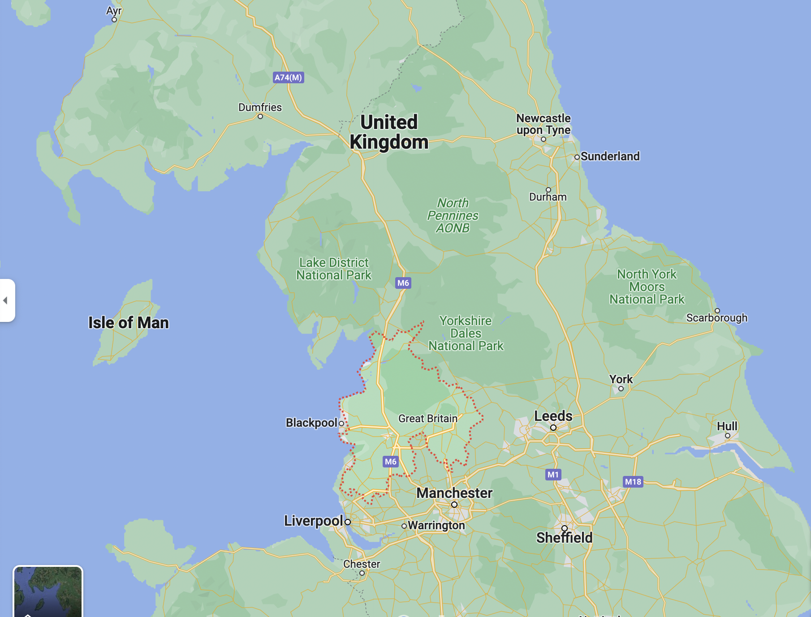

# 铁路改变世界

## Basic Info

**Author**: Christian Wolmar

**English Name**: Blood, Iron, and Gold: How the Railways Transformed the World

## Chapter 1    早期铁路

1830.9 [利物浦——曼彻斯特铁路](https://en.wikipedia.org/wiki/Liverpool_and_Manchester_Railway)开通

* 双轨铁路
* 全程使用蒸汽动力

**标准轨距**

17世纪 马车道网络 Newcastle Roads

### 蒸汽机车的历史

* 18世纪初 纽科门制造出第一批能工作的蒸汽机
* 18世纪末 瓦特 改进蒸汽机效率
* 1801年 理查德·特里维西克 开始试验铁路上的蒸汽机车
* 1814年 乔治·史蒂文森 成功造出铁路蒸汽机车
* 1820s初 斯托克顿——达林顿铁路：第一条蒸汽机牵引的公用铁路
* 1829年 史蒂芬森的“火箭号”在 Ranhill Trial 中获胜

利物浦：重要港口，原棉的主要到达地

曼切斯特：工业中心，棉纺织业繁荣

* 1830年 利物浦～曼彻斯特铁路开通
  * 为货运修建，但客运繁盛

铁路为农产品打开巨大市场

* 1840年 铁路主干线：伦敦——伯明翰——利物浦——曼彻斯特

* 1844年 透纳 《雨、蒸汽、速度》

法国 1829 第一条铁路开通：圣埃蒂安线。1832年 开始使用机车

美国 [巴尔的摩——俄亥俄铁路](https://en.wikipedia.org/wiki/Baltimore_and_Ohio_Railroad) by Philip E. Thomas and George Brown

## Chapter 2    欧洲先行     

欧洲大多数国家的第一条铁路，都是使用或者抄袭了英国的技术。

1835 比利时、巴伐利亚、萨克森

1838 奥地利

1839 意大利、荷兰

欧洲大陆有更多国家主导的铁路

盎格鲁-撒克逊特色 vs 欧洲特色

铁路是国家统一工具

### 比利时

* 1830年才从荷兰脱离出来
* 铁路被视为一个国家促进国家民族意识的方式
* 当时世界最密集的铁路网

### 荷兰

* 铁路需要和水运竞争
* 工业化程度低
* 地形不适合铁路修建
* [莱茵铁路]()

### 法国

* 铁路发展缓慢。法国人对新技术的价值表示怀疑。反对者较多
* 法国公路网发达，运河宽阔，铁路并没有那么诱人。
* 第一条主干线：[巴黎—乐佩克铁路](https://www.columbia.edu/~brennan/atmo/07_LEPECQ.html)
* 1840 严重事故
* 1837 铁路发展计划：主干线从巴黎向外辐射，公私合营。发展缓慢

### 德国

* 铁路被视作统一国家的手段
* [李斯特](https://en.wikipedia.org/wiki/Friedrich_List) 铁路的强烈倡导者
* 德国的第一条主干铁路：[莱比锡——德累斯顿线](https://en.wikipedia.org/wiki/Friedrich_List)；大量聘用英国人

* 铁路推动跨国贸易，迫使各邦国降低关税，减少官僚主义作风，将德国推向统一
* 1846 德国铁路管理协会，确定相同关税
* 铁路刺激德国自身工业发展：提供了焦炭等工业原料在内的廉价运输

### 意大利

* 第一条铁路规模小，在那不勒斯（两西西里王国）
* 1846 庇护九世当选教皇，支持铁路发展（教皇国）
* 1853 第一条山间铁路：都灵—热那亚（皮埃蒙特）
* 铁路在意大利的统一中起到了重要作用

**史蒂文森标准轨距**

### 伊比利亚

* 采用不同的轨距
* 西班牙政府孤立主义（害怕法国入侵）
* 1837 西班牙第一条铁路出现在古巴（拉美第一条铁路）

### 俄国

* 格斯特纳 1837 圣彼得堡—沙皇村试验线

* 1851 莫斯科—圣彼得堡铁路

### 总结

* 铁路成为了整个国家经济实力的源泉
* 客运兴盛
* 铁路将国家统一在一起，将不同地区连接在一起
* 欧洲大陆各国对铁路有严格约束：军事重要性

## Chapter 3     英国的影响

英国在铁路发展中有巨大优势，保持领先地位

技术被广泛效仿

自由放任

爱尔兰：[都柏林—金斯顿铁路](https://en.wikipedia.org/wiki/Dublin_and_Kingstown_Railway)

爱尔兰铁路发展有些过剩，主要目的是政治性和社会性的。

### 印度

* 铁路由东印度公司引入
* 原因之一：英国对印度棉花的需求
* 集中规划
* 印度铁路网的修建由[达尔豪西勋爵](https://en.wikipedia.org/wiki/James_Broun-Ramsay,_1st_Marquess_of_Dalhousie)主持
* 帝国工程，殖民色彩严重，完全由英国人说了算
* 军事上的考量：方便平定印度各地的叛乱
* 1853.4 远东第一条铁路 孟买—特纳线

* 高止山脉铁路工程：环境糟糕，伤亡巨大，疫病流行

* 英国人学到了需要融入当地文化
* 铁路是经济发展的强劲发动机，但对英国作用却比对印度更大；经济利益绝大多数流向英国人，最好的铁路服务几乎只有白人能享用
* 种族隔离

### 澳大利亚

* 第一条铁路使用人力
* 铁路建设困难重重，发展缓慢：不同州轨距不同
