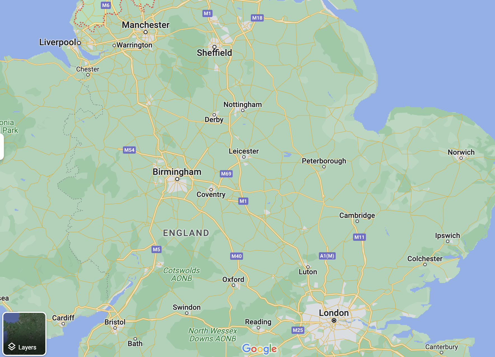

# 铁路改变世界

## Basic Info

**Author**: Christian Wolmar

**English Name**: Blood, Iron, and Gold: How the Railways Transformed the World

## Chapter 1    早期铁路

1830.9 [利物浦——曼彻斯特铁路](https://en.wikipedia.org/wiki/Liverpool_and_Manchester_Railway)开通

* 双轨铁路
* 全程使用蒸汽动力

**标准轨距**

17世纪 马车道网络 Newcastle Roads

### 蒸汽机车的历史

* 18世纪初 纽科门制造出第一批能工作的蒸汽机
* 18世纪末 瓦特 改进蒸汽机效率
* 1801年 理查德·特里维西克 开始试验铁路上的蒸汽机车
* 1814年 乔治·史蒂文森 成功造出铁路蒸汽机车
* 1820s初 斯托克顿——达林顿铁路：第一条蒸汽机牵引的公用铁路
* 1829年 史蒂芬森的“火箭号”在 Ranhill Trial 中获胜

利物浦：重要港口，原棉的主要到达地

曼切斯特：工业中心，棉纺织业繁荣

* 1830年 利物浦～曼彻斯特铁路开通
  * 为货运修建，但客运繁盛

铁路为农产品打开巨大市场

* 1840年 铁路主干线：伦敦——伯明翰——利物浦——曼彻斯特

* 1844年 透纳 《雨、蒸汽、速度》

法国 1829 第一条铁路开通：圣埃蒂安线。1832年 开始使用机车

美国 [巴尔的摩——俄亥俄铁路](https://en.wikipedia.org/wiki/Baltimore_and_Ohio_Railroad) by Philip E. Thomas and George Brown

## Chapter 2    欧洲先行     

欧洲大多数国家的第一条铁路，都是使用或者抄袭了英国的技术。

1835 比利时、巴伐利亚、萨克森

1838 奥地利

1839 意大利、荷兰

欧洲大陆有更多国家主导的铁路

盎格鲁-撒克逊特色 vs 欧洲特色

铁路是国家统一工具

### 比利时

* 1830年才从荷兰脱离出来
* 铁路被视为一个国家促进国家民族意识的方式
* 当时世界最密集的铁路网

### 荷兰

* 铁路需要和水运竞争
* 工业化程度低
* 地形不适合铁路修建
* [莱茵铁路]()

### 法国

* 铁路发展缓慢。法国人对新技术的价值表示怀疑。反对者较多
* 法国公路网发达，运河宽阔，铁路并没有那么诱人。
* 第一条主干线：[巴黎—乐佩克铁路](https://www.columbia.edu/~brennan/atmo/07_LEPECQ.html)
* 1840 严重事故
* 1837 铁路发展计划：主干线从巴黎向外辐射，公私合营。发展缓慢

### 德国

* 铁路被视作统一国家的手段
* [李斯特](https://en.wikipedia.org/wiki/Friedrich_List) 铁路的强烈倡导者
* 德国的第一条主干铁路：[莱比锡——德累斯顿线](https://en.wikipedia.org/wiki/Friedrich_List)；大量聘用英国人

* 铁路推动跨国贸易，迫使各邦国降低关税，减少官僚主义作风，将德国推向统一
* 1846 德国铁路管理协会，确定相同关税
* 铁路刺激德国自身工业发展：提供了焦炭等工业原料在内的廉价运输

### 意大利

* 第一条铁路规模小，在那不勒斯（两西西里王国）
* 1846 庇护九世当选教皇，支持铁路发展（教皇国）
* 1853 第一条山间铁路：都灵—热那亚（皮埃蒙特）
* 铁路在意大利的统一中起到了重要作用

**史蒂文森标准轨距**

### 伊比利亚

* 采用不同的轨距
* 西班牙政府孤立主义（害怕法国入侵）
* 1837 西班牙第一条铁路出现在古巴（拉美第一条铁路）

### 俄国

* 格斯特纳 1837 圣彼得堡—沙皇村试验线

* 1851 莫斯科—圣彼得堡铁路

### 总结

* 铁路成为了整个国家经济实力的源泉
* 客运兴盛
* 铁路将国家统一在一起，将不同地区连接在一起
* 欧洲大陆各国对铁路有严格约束：军事重要性

## Chapter 3     英国的影响

英国在铁路发展中有巨大优势，保持领先地位

技术被广泛效仿

自由放任

爱尔兰：[都柏林—金斯顿铁路](https://en.wikipedia.org/wiki/Dublin_and_Kingstown_Railway)

爱尔兰铁路发展有些过剩，主要目的是政治性和社会性的。

### 印度

* 铁路由东印度公司引入
* 原因之一：英国对印度棉花的需求
* 集中规划
* 印度铁路网的修建由[达尔豪西勋爵](https://en.wikipedia.org/wiki/James_Broun-Ramsay,_1st_Marquess_of_Dalhousie)主持
* 帝国工程，殖民色彩严重，完全由英国人说了算
* 军事上的考量：方便平定印度各地的叛乱
* 1853.4 远东第一条铁路 孟买—特纳线

* 高止山脉铁路工程：环境糟糕，伤亡巨大，疫病流行

* 英国人学到了需要融入当地文化
* 铁路是经济发展的强劲发动机，但对英国作用却比对印度更大；经济利益绝大多数流向英国人，最好的铁路服务几乎只有白人能享用
* 种族隔离

### 澳大利亚

* 第一条铁路使用人力
* 铁路建设困难重重，发展缓慢：不同州轨距不同

## Chapter 4    美国之路

**没有铁路，美国就不成其为美国。**

railroads （美）

railway （英）

#### 规模更大

* 线路长度更长
* 火车更大，运力更强

美国铁路更接近英国，没有集中规划，强调竞争而非协调

车厢内部开敞布置，没有卧铺包间

#### 早期坐美国的火车非常受罪

* 车厢狭窄闷热
* 机车的浓烟和火星
* 夜间行车危险（照明相当重要）

可以租用车厢

北方铁路远比南方舒适

食物都无法保证卫生

一旦登上火车，乘客并不能保证到达目的地。火车无法遵守固定的时刻表

#### 危险

* 车厢脱离出轨 [Franklin Pierce](https://en.wikipedia.org/wiki/Franklin_Pierce#Transition_and_train_crash)
* 正面相撞（[Cornfield meets](https://en.wiktionary.org/wiki/cornfield_meet)），早期信号系统几乎没有。电报发明前调度员极易犯错
* 缺乏错车环道，列车有时候需要倒车

**欧洲的铁路通常是已经建立的村镇的服务者，而美国的铁路却是它们的创建者**

铁路在广袤的大陆上传播发展和“文明”

运河[^1]与铁路的争斗

#### 政府的参与

* 国有企业进行铁路计划
* 对私人建铁路提供补贴
* 铁路可能获得垄断权、免税权、彩票经营权、“**国家征用土地权**”（强制购买）等特许权

#### 美国铁路的特点

* 一般会选择工程量最小的线路，避免隧道和挖掘
* 桥梁事故比欧洲频繁
* 机车的大小和功率大

* 单位造价相对较低
* 球形烟囱：减少火星
* 排障器：对付轨道上的牛群等障碍

**电报的出现**，为铁路的更广泛使用起到了最关键的作用。

#### 铁路与电报的共生

* 电报线路沿铁路而建
* 铁路免费使用电报，彼此沟通，极大降低了事故率

因铁路产生的新旅游路线：查理斯顿—汉堡（[Charleston & Hamburg Railroad](https://www.asce.org/about-civil-engineering/history-and-heritage/historic-landmarks/charleston-hamburg-railroad)）

当地居民渴望铁路网

早期的铁路主要由小人物投资，像终点城市里的生意人和商人、沿途居住的农夫和零售商等，他们都希望通过土地增值和生意扩大获得好处。

#### 查尔斯顿——汉堡线

* 当时世界最长的铁路（136英里）
* Charleston 的棉花商人需要出河口

#### 波士顿—洛厄尔铁路

[Boston and Lowel Railroad](https://en.wikipedia.org/wiki/Boston_and_Lowell_Railroad)

* 为纺织业提供服务[^2]

#### 波士顿—普罗维登斯铁路

* 连接马萨诸塞和罗德岛

#### 西部铁路

* Worcester——Albany

推动早期铁路线建设的，常常是来自运输煤炭和其他矿产的需要。

铁路的修建让美国人能吃到来自远方的新鲜食品

在美国修建铁路花费远低于欧洲

早期美国铁路多集中在新英格兰和濒临大西洋的中部各州。Pennsylvania 占了总里程的 1/4

轨距不同，但后来标准轨距开始占主导

#### 同一座城市中线路不互通：

* 铁路公司之间缺乏协调和规划
* 存在既得利益者（当地的转运公司等）

## Chapter 5    连接欧洲

19世纪下半叶，铁路普遍成为最主要的客、货运方式

19世纪50年代初，英国有超过7000英里的铁路

欧洲大陆政府对铁路的管制比英美严格得多（原因：铁路很多有军事目的），对铁路有补贴

在欧洲，费率很大程度上由政府设定，铁路被视作一种公共服务

#### 19世纪下半叶

* 专制君主政体让位于政治参与更广泛的国家政府
* 民众把铁路网是为地方经济前途的关键因素
* 铁路作用变得丰富
  * 连接大城市
  * 运输矿产和煤炭
  * 通勤
  * 连接两座较小的贸易伙伴城市
* 联络线大量出现

**[赛梅林铁路](https://en.wikipedia.org/wiki/Semmering_railway)**

* 第一条跨阿尔卑斯山的铁路
* 维也纳——的里雅斯特
* 总工程师 Karl Ritter von Ghega
* 修建时伤亡惨重
* 1853.10 开通
* 世界遗产

### 法国

法国管制严格

1842年法案，规定政府担当建设基础设施和主体结构，各公司负责铺设轨道，提供车辆

六大铁路公司：

* 北部铁路公司
* 西部公司
* 米迪公司
* 东部公司
* 巴黎—奥尔良公司
* 巴黎—里昂—地中海公司：后来法国最大的铁路公司
* PLM公司

1865 允许各省市修建小型支线

铁路狂热，大量公司亏损

1878 国营铁路公司 

国有铁路网：由国家控制

### 意大利

1856 罗马第一条铁路

意大利地形不适合修铁路：

* 亚平宁山脉：天然屏障
* 南部贫困：大部分铁路网亏损
* 铁轨、煤炭、车辆依赖进口：成本更高

> 统一的意大利的新政权承担不起铁路的修建和运营，但也承担不起铁路不修建、不运营。

国家与铁路公司之间的复杂关系

铁路危机

新的意大利王国支持修建铁路：

* 统一全国
* 刺激南方经济发展

建国的第一个五年：建成铁路1200英里

1865年 政府将铁路网整合为四大公司：

* 阿尔塔意大利公司：北部。伦巴第—威尼斯、皮埃蒙特
* 罗马铁路公司：罗马、托斯卡纳地区
* 南方铁路公司：博洛尼亚—布林迪西
* 卡拉布罗—西西里铁路公司：西西里岛和南方

外资问题：意大利人反对外资

四大公司营收不好，开始国有化

> 铁路公司从本质上来说与传统的公司不同，因为它们提供的是公共服务，而这种公共服务一般情况下都应该持续运行，不管能否盈利......再者，铁路公司拥有庞大的固定资产，在经济繁荣的时候可被大量地使用并由此带来利润，但在经济萧条的时候也不是那么容易就暂时封存或关闭。因此，铁路公司在变幻莫测的循环经济下，或是在出现了强有力对手的情况下，往往就会显得特别脆弱。

### 德国

1870年 德意志统一，铁路在各邦国的基础上修建。不同邦国国家介入程度不同

俾斯麦的政策：

* 一开始自由放任，给予铁路大量的
* 1870年德意志统一后，开始标准化：压缩空气制动器
* 1879—1880 颁布法律，帝国有权强制收购私人铁路公司 组建皇家普鲁士铁路公司
* 国有化目的：军事考量，快速调配军队的能力

### 瑞士

#### 圣哥达隧道

* 意大利、德国、瑞士联合投资，意大利承担大头
* 打通德国与意大利的连接
* 工程师：路易斯·法夫雷 Louis Favre

[^1]:参考[《大河与大国》](../../us_history/notes/the_source_how_rivers_made_america_and_america_remade_its_rivers.md)
[^2]: 波士顿当时纺织业繁盛，见[《无墙之城》](the_walless_city.md)
