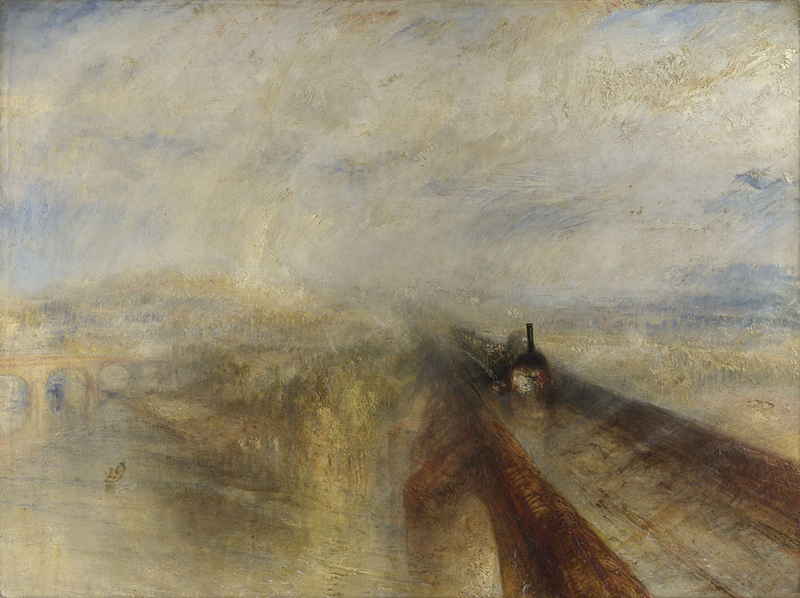

# 铁路改变世界

## Basic Info

**Author**: Christian Wolmar

**English Name**: Blood, Iron, and Gold: How the Railways Transformed the World

## Chapter 1    早期铁路

1830.9 [利物浦——曼彻斯特铁路](https://en.wikipedia.org/wiki/Liverpool_and_Manchester_Railway)开通

* 双轨铁路
* 全程使用蒸汽动力

**标准轨距**

17世纪 马车道网络 Newcastle Roads

### 蒸汽机车的历史

* 18世纪初 纽科门制造出第一批能工作的蒸汽机
* 18世纪末 瓦特 改进蒸汽机效率
* 1801年 理查德·特里维西克 开始试验铁路上的蒸汽机车
* 1814年 乔治·史蒂文森 成功造出铁路蒸汽机车
* 1820s初 斯托克顿——达林顿铁路：第一条蒸汽机牵引的公用铁路
* 1829年 史蒂芬森的“火箭号”在 Ranhill Trial 中获胜

利物浦：重要港口，原棉的主要到达地

曼切斯特：工业中心，棉纺织业繁荣

* 1830年 利物浦～曼彻斯特铁路开通
  * 为货运修建，但客运繁盛

铁路为农产品打开巨大市场

* 1840年 铁路主干线：伦敦——伯明翰——利物浦——曼彻斯特

* 1844年 透纳 《雨、蒸汽、速度》

法国 1829 第一条铁路开通：圣埃蒂安线。1832年 开始使用机车

美国 [巴尔的摩——俄亥俄铁路](https://en.wikipedia.org/wiki/Baltimore_and_Ohio_Railroad) by Philip E. Thomas and George Brown

