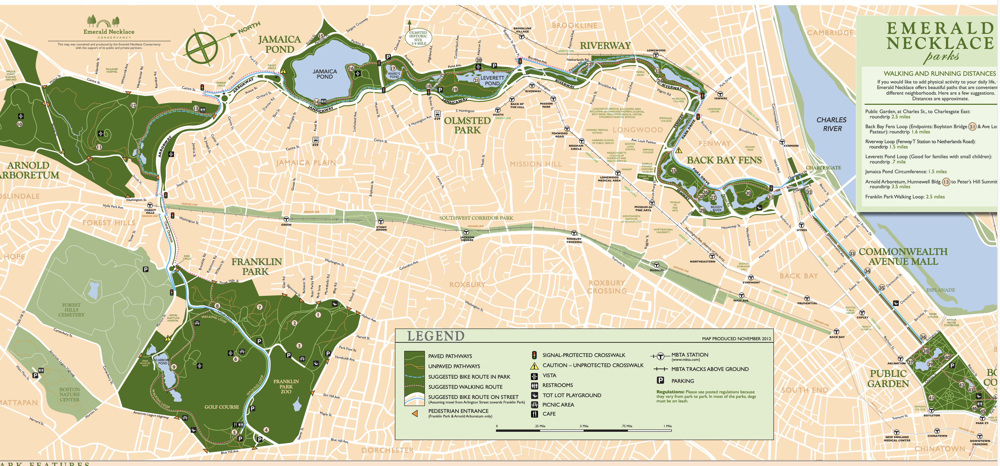

# 无墙之城

## Basic Info

**Subtitle**: 美国历史上的城市与自然

**Author**: 侯深

## 绪论

大纲：

* **城市书写**：对美国环境史学发展脉络的梳理
* **增长的城市**：从城市内部考察美国城市环境史的演化
* **扩张的城市**：从城市外部考察美国城市环境史的演化
* **城市的思想景观**：从思想层面考察美国城市环境史的演化

## 在自然中重写城市的历史

Thomas Cole:

Savage State

The Arcadian or Pastoral State

the Cosummation of Empire

Destruction

Desolation

## 山巅之城 —— 波士顿

### 新英格兰愿景

[约翰·温斯洛普](https://en.wikipedia.org/wiki/John_Winthrop)：《山巅之城》布道

Boston 1630s

河狸的消失

皮毛贸易

1813 [波士顿制造公司](https://en.wikipedia.org/wiki/Boston_Manufacturing_Company)（the Boston Manufacturing Company）成立，标志着北美的工业化

早期：[梅里马克河](https://en.wikipedia.org/wiki/Merrimack_River)、[查尔斯河](https://en.wikipedia.org/wiki/Charles_River)沿岸的纺织工业

波士顿的填海造陆史：

1803 - 1863 	West Cove

1804 - 1835 	Mill Pond

1806 - 1843 	South Cove

1823 - 1874 	East Cove

1836 - 1988 	South Boston

1850 - 1988 	South Bay

1857 - 1894 	Back Bay

1860 - 1896 	Charlestown

1878 - 1890 	Fenway

19世纪 大量信仰天主教的爱尔兰移民来到波士顿

填海造陆很大程度上也是为了解决污染问题，比如 Back Bay

"回归自然" 

进步主义时期：

Olmsted: the Boston urban park system, aka '**Emerald Necklace**'

