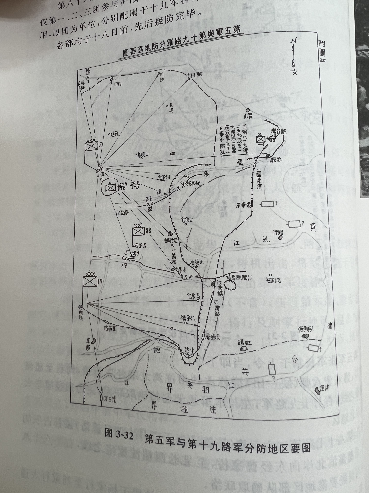

# 一·二八淞沪抗战

## 八十八师
> 中国是个亚洲穷国，当时人均收入只及日本的六十六分之一，德国的一百二十分之一，美国的二百分之一。如果照搬德军标准，那么装备一个“德械师”的军费开支足以武装几十个师甚至更多中央军，很显然如此庞大的军费远远超过国库承受力。

八十八师：德械师

师长：俞济时

副师长：李延年

参谋长：宣铁吾

## 一·二八淞沪抗战的三个阶段

### 第一阶段（1.28 — 2.7）

1.28 事件爆发

战线限于闸北地区

日军以海军陆战队为主

我军以十九路军为主体（闸北主力六十师，七十八师一部；六十一师警备江湾大场一线；吴淞、宝山防线由七十八师为主力，附六十师一部），指挥官：蒋光鼐、蔡廷锴

2.7 日增援陆军到达上海

### 第二阶段（2.7 — 2.23）

2.23 庙行之战

战线延伸至江湾、庙行、吴淞、宝山

日军第九师团及第二十四混成旅团增援 植田谦吉

我军 第五军（八十七、八十八师）、税警总团、中央教导队增援 张治中 江湾、庙行、大场一线防务

### 第三阶段（2.24 — 3.2）

日军第十一、第十四师团增援

我军不支，放弃淞沪近郊阵地，撤至昆山、福山一线

## 一·二八之前

### 万宝山事件

### 日僧事件

## 开战

### 首战

1.28夜11:30 日军占领天通庵车站

日军三路进攻：

- 天通庵路
- 虬江路
- 横浜路

我军左翼阵地 天通庵路 — 青云路一线

### 商务印书馆被炸

1.29 上午10时

## 八十八师增援，日陆军参战

### 新布防

右翼 十九军：南市—龙华—北新泾—真如—闸北—江湾 主力保持于真如—大场之间 目标：压迫敌军于引翔港

左翼 第五军：庙行东段—蔡家宅—胡家宅—曹家桥 主力控置于大场、杨行、刘行地区

十九军七十八师一五六旅固守吴淞要塞，相机占领张华浜车站

### 日军“中央突破”

2.20 日军猛攻江湾—庙行一线，分多路进攻江湾跑马场

### 庙行大捷

敌军进攻庙行—麦家宅一线

宋希濂强渡蕴藻浜

